# AWS CLOUD SOLUTION FOR 2 COMPANY WEBSITES USING A REVERSE PROXY TECHNOLOGY


## Table of Contents
- [Introduction](#introduction)
- [Starting Off Your AWS Cloud Project](#starting-off-your-aws-cloud-project)
- [SET UP A VIRTUAL PRIVATE NETWORK (VPC)](#set-up-a-virtual-private-network-vpc)
- [Creating the Subnets](#creating-the-subnets)
- [Creating the Route Tables](#creating-the-route-tables)
- [Creating an Elastic IP](#creating-an-elastic-ip)
- [Creating a NAT Gateway](#creating-a-nat-gateway)
- [Creating the Security Groups](#creating-the-security-groups)
- [Assigning Certificate and creating Hosted Zone](#assigning-certificate-and-creating-hosted-zone)
- [Creating the Elastic File System (EFS)](#creating-the-elastic-file-system-efs)
- [Creating the Relational Database Service (RDS), Key Management Service (KMS) and Subnet Groups](#creating-the-relational-database-service-rds-key-management-service-kms-and-subnet-groups)
- [Creating our Resources](#creating-our-resources)
    - [Bastion AMI installation](#bastion-ami-installation)
    - [Nginx AMI installation](#nginx-ami-installation)
    - [Webserver AMI installation](#webserver-ami-installation)
    - [Creating our AMI images](#creating-our-ami-images)
    - [Creating our Target groups](#creating-our-target-groups)
    - [Creating our Load Balancers](#creating-our-load-balancers)
    - [Creating the Autoscaling Groups](#creating-the-autoscaling-groups)
    - [Creating the Route53 records](#creating-the-route53-records)

## Introduction
In this project, you will build a secure infrastructure inside AWS VPC (Virtual Private Cloud) network for a fictitious company (Choose an interesting name for it) that uses WordPress CMS for its main business website, and a Tooling Website (https://github.com/manny-uncharted/tooling) for their DevOps team. As part of the company’s desire for improved security and performance, a decision has been made to use a reverse proxy technology from NGINX to achieve this.

Cost, Security, and Scalability are the major requirements for this project. Hence, implementing the architecture designed below, ensure that infrastructure for both websites, WordPress and Tooling, is resilient to Web Server’s failures, can accomodate to increased traffic and, at the same time, has reasonable cost.


## Starting Off Your AWS Cloud Project
There are few requirements that must be met before you begin:

1. Properly configure your AWS account and Organization Unit [Watch How To Do This Here](https://youtu.be/9PQYCc_20-Q)

    - Create an AWS Master account. (Also known as Root Account).
    - Within the Root account, create a sub-account and name it DevOps. (You will need another email address to complete this)

    Note: For a newly created account you might need to configure AWS service quota to allow you to create more accounts on the root account. [Read how to do this here](https://aws.amazon.com/premiumsupport/knowledge-center/organizations-account-exceeded/#:~:text=Resolution,Line%20Interface%20(AWS%20CLI).)
    
    result:
    
    - Within the Root account, create an AWS Organization Unit (OU). Name it Dev. (We will launch Dev resources in there)
    
    result:
    
    - Move the DevOps account into the Dev OU.

    result:
    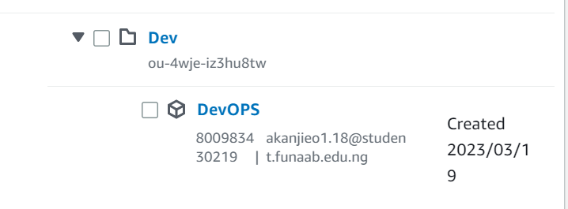
    - Login to the newly created AWS account using the new email address.
2. Create a free domain name for your fictitious company at Freenom domain registrar [here](https://www.freenom.com/).

3. Create a hosted zone in AWS, and map it to your free domain from Freenom. [This gives a guide on how to do this](https://youtu.be/IjcHp94Hq8A)


## SET UP A VIRTUAL PRIVATE NETWORK (VPC)
A VPC is a virtual network that you can define within AWS. It is logically isolated from other virtual networks in the AWS Cloud. You can launch your AWS resources, such as Amazon EC2 instances, into your VPC. You can specify an IP address range for the VPC, add subnets, associate security groups, and configure route tables. You can also create an Internet gateway and attach it to your VPC so that instances have access to the Internet. For more information, see [Amazon VPC User Guide](https://docs.aws.amazon.com/vpc/latest/userguide/what-is-amazon-vpc.html).

We would be using the architecture diagram above for this project.

- Create a VPC

    result:
    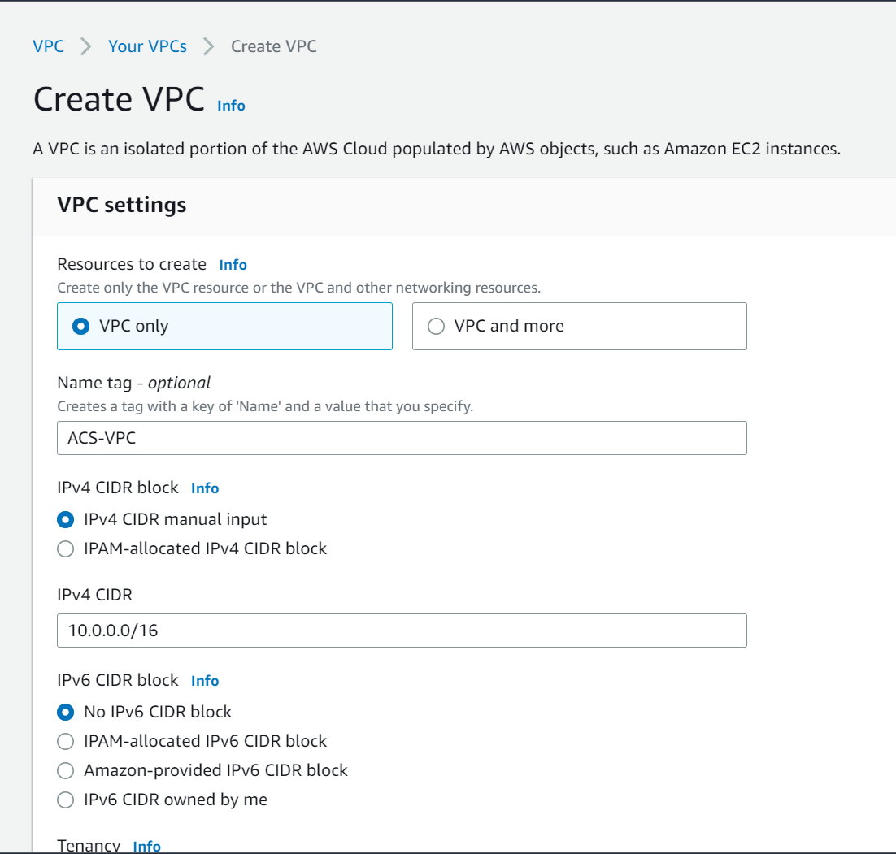
    - We need to ensure that dns hostnames are enabled for our VPC. This is to ensure that our EC2 instances can resolve each other using their private IP addresses. To do this, go to the VPC dashboard, select your VPC, and click on the Actions button. Select Edit DNS Hostnames and enable it.

    result:
    
- Create an internet gateway and attach it to the created vpc.

    result:
    
    - Then attach the internet gateway to the VPC.

    result:
    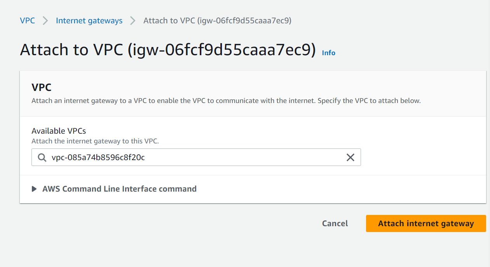

## Creating the Subnets
- The next thing is to create the subnets. We would use [ipinfo](ipinfo.io/ips) to get the IP address ranges for the different regions. You can decide how you intend to assign the IP address ranges to the subnets. Here I would be using even-number addresses for public subnets and odd-number IP addresses for private subnets.
We would use the IP address ranges for the different regions to create the subnets. We would create 6 subnets for the VPC. Two public subnets and four private subnets The subnets would be in the us-east-1 availability zone. As we would be using <b>us-east-1a</b> and <b>us-east-1b</b>.

    result:

    Public subnet 1
    

    Public subnet 2
    

    Private subnet 1
    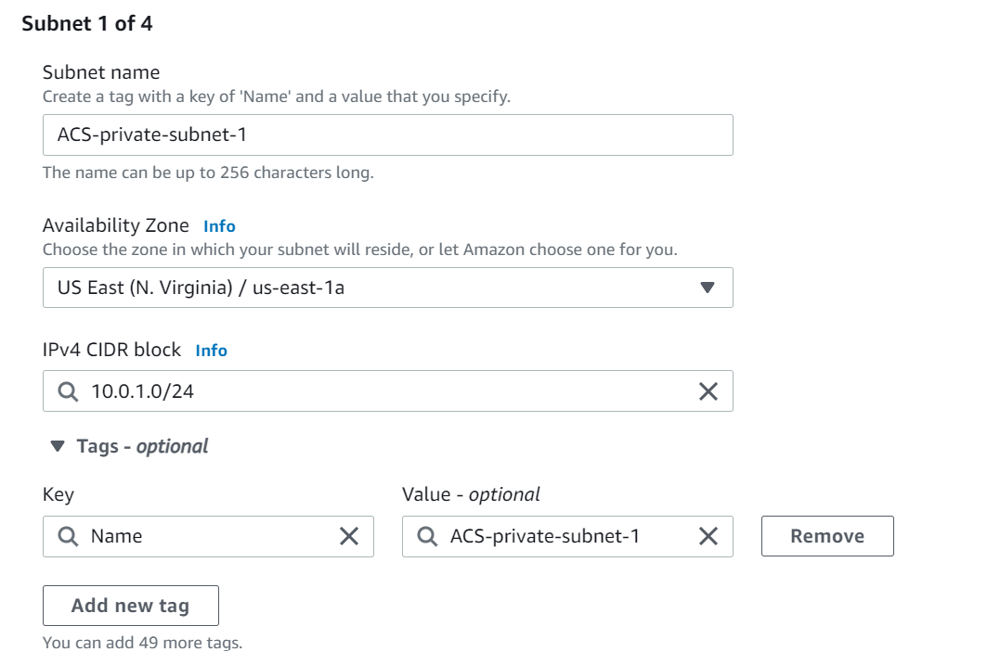

    Private subnet 2
    

    Private subnet 3
    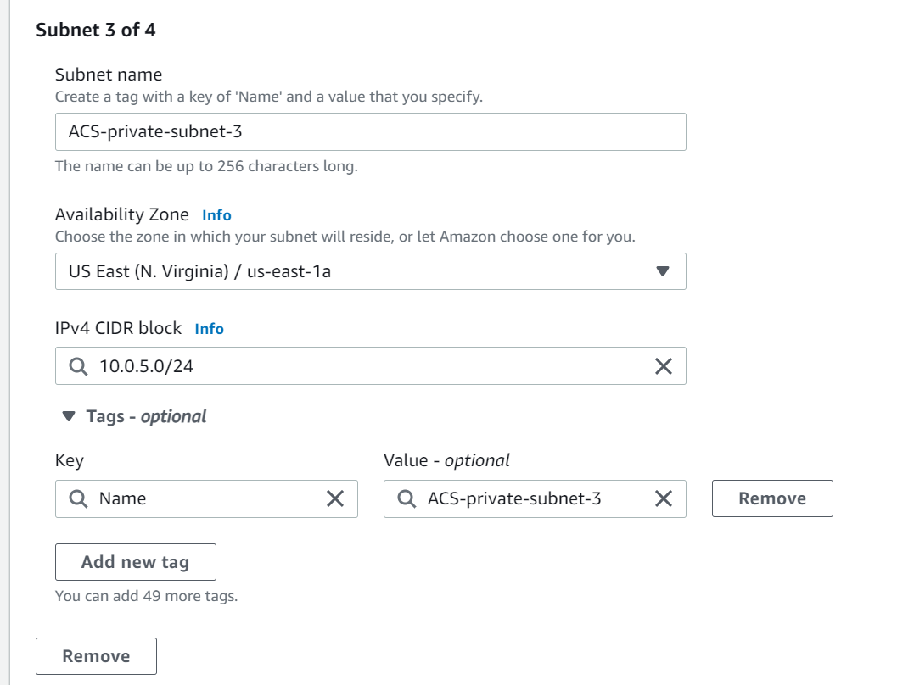

    Private subnet 4
    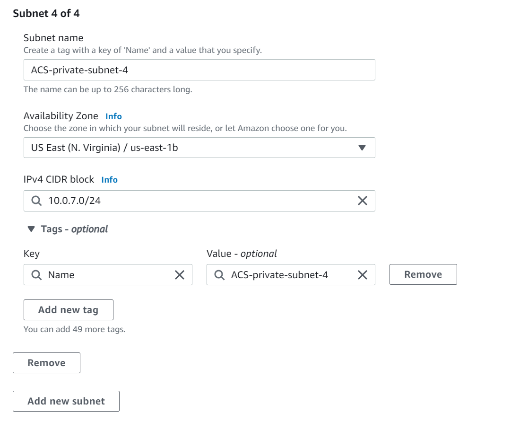


## Creating the Route Tables

- We then move on to creating the route tables. Here, we would be creating two route tables. A public and private route table.

    result:

    Public route table
    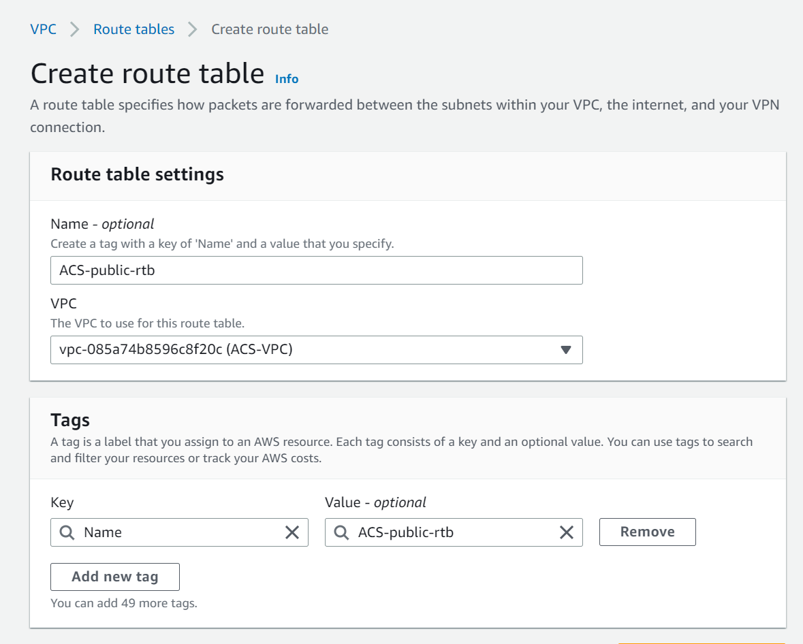

    Private route table
    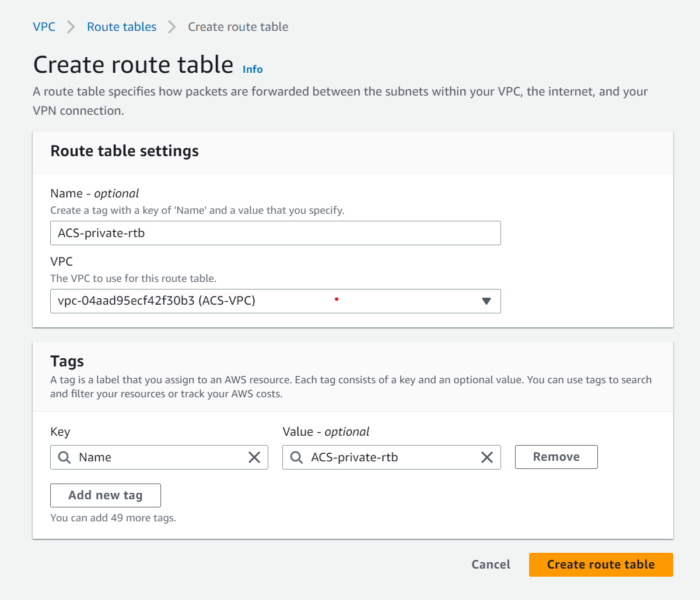

- Now we associate the route tables with their corresponding subnets. Navigate to the subnet associations after selecting the route table and click on edit associations. Select the subnets you want to associate with the route table and click save.

    result:

    Associate public route table with public subnets
    

    Associate private route table with private subnets
    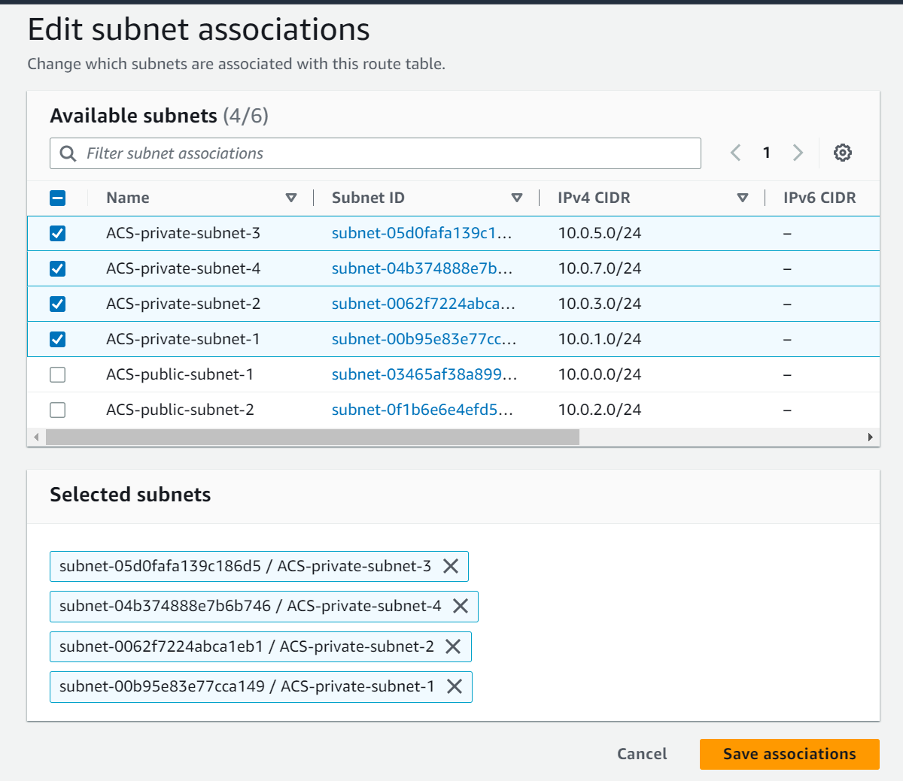

- Now we need to edit the routes of the route tables. 
    
    - For the public route table, we would add a route to the internet gateway. This is to allow the public subnets to have access to the internet. To do this, click on the route table, select routes, and click on edit routes. Add a new route with the destination as '0.0.0.0/0' and the target as the internet gateway, this would bring up the internet gateway drop down. Select the internet gateway you created earlier and click save.

        result:
        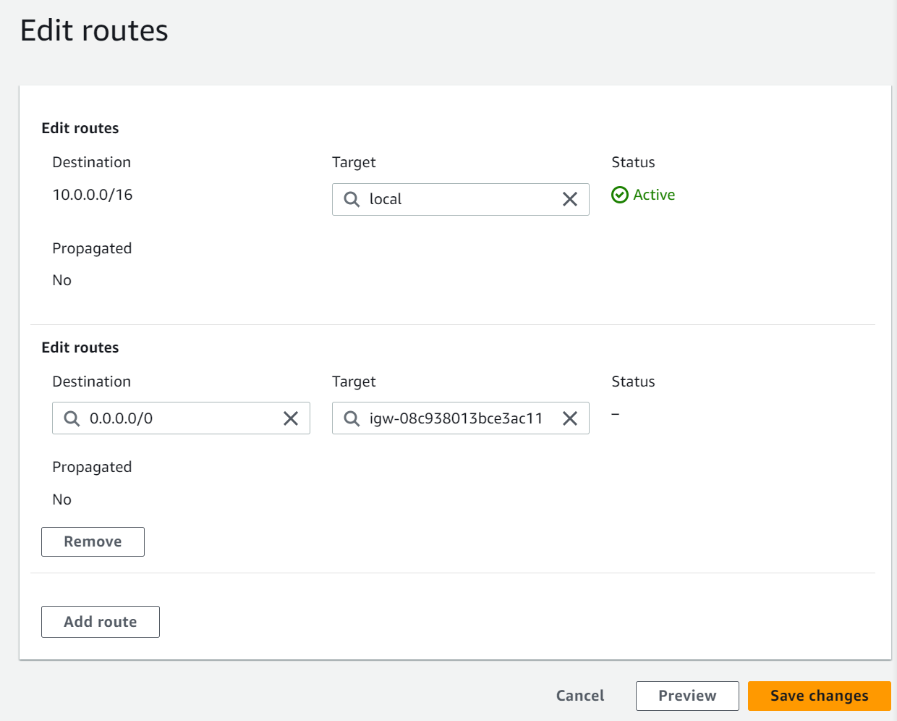


## Creating an Elastic IP
    - Before we create the private route, we need to create an elastic ip address.

        result:
        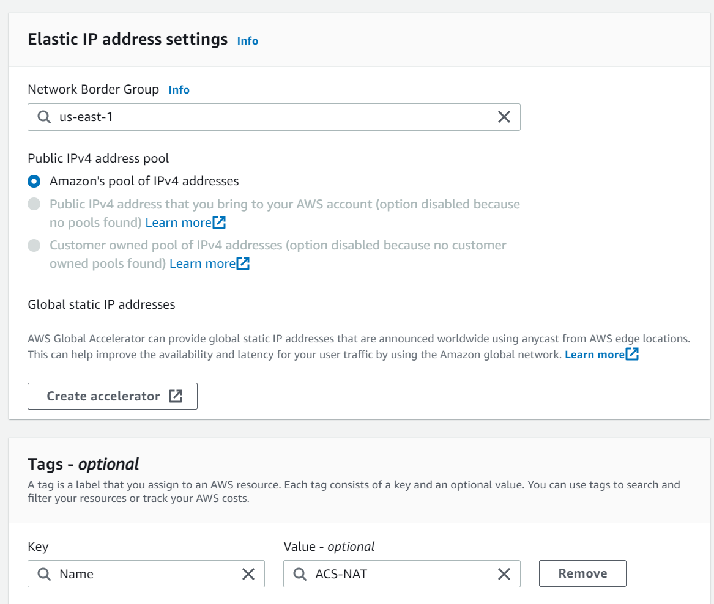


## Creating a NAT Gateway
    - Then we need to create NAT gateways.

        result:
        

    - Now let's navigate back to our route tables and select the private route table. Click on routes and edit routes. Add a new route with the destination as '0.0.0.0/0' and the target as the NAT gateway. This would bring up the NAT gateway dropdown. Select the NAT gateway you created earlier and click save.

        result:
        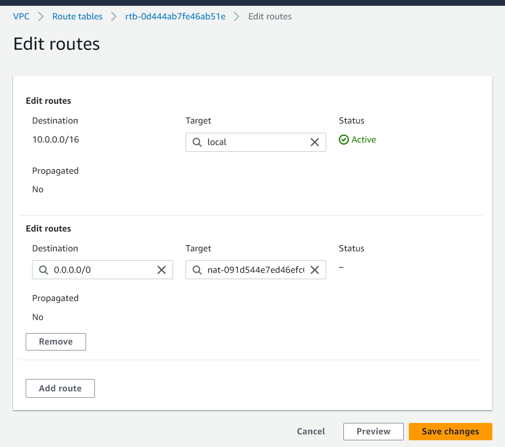


## Creating the Security Groups

- Now we need to create security groups for all the application resources. It is important to allocate the security groups we create to the vpc created earlier.
    - Create a security group for our External Application Load Balancer (ALB). This would be a public security group. This is to allow the ALB to receive traffic from the internet. We would allow traffic on port 80 and 443. This is to allow traffic from the internet to the ALB.

        result:
        

    - Create a security group for our Bastion host. This is to allow us to access the Bastion host from the internet. We would allow traffic on port 22. And we would restrict the source to our IP address.

        result:
        

    - Create a security group for the Nginx reverse proxy server. It is important to note that from the architecture diagram, the Nginx reverse proxy server interacts with the application load balancer (ALB) and not the bastion. So the source of the traffic would be the ALB security group. We would allow traffic on port 80 and 443. And we would restrict the source to the ALB security group. For emergencies, we need to allow ssh traffic from the bastion server. So we would allow traffic on port 22 and restrict the source to the bastion security group.
    
        result:
        

    - We also need to create a security group for the internal application load balancer (ALB). This is to allow the ALB to receive traffic from the Nginx reverse proxy server. We would allow traffic on port 80 and 443. And we would restrict the source to the Nginx reverse proxy server security group.

        result:
        

    - We also need to create a security group for our web servers and the traffic should come only from our internal application load balancer (ALB). We would allow traffic on port 80 and 443. And we would restrict the source to the internal ALB security group. And also ssh from the bastion server only.

        result:
        

    - We also need to create a security group for the Data Layer. This is to allow the web servers to connect to the database. We would allow traffic on port 3306. And we would restrict the source to the web server security group.

        result:
        


## Assigning Certificate and creating Hosted Zone
- We need to create our certificates, before this you need to get a domain and transfer it to AWS Route 53. [Here's a guide on how to transfer your domain](https://www.youtube.com/watch?v=3lWo3ovMhTA)

- Now create a hosted zone in route 53 bearing the name of your domain. Then create a record set for the domain. This is to allow the domain to resolve to the ALB.

    result:
    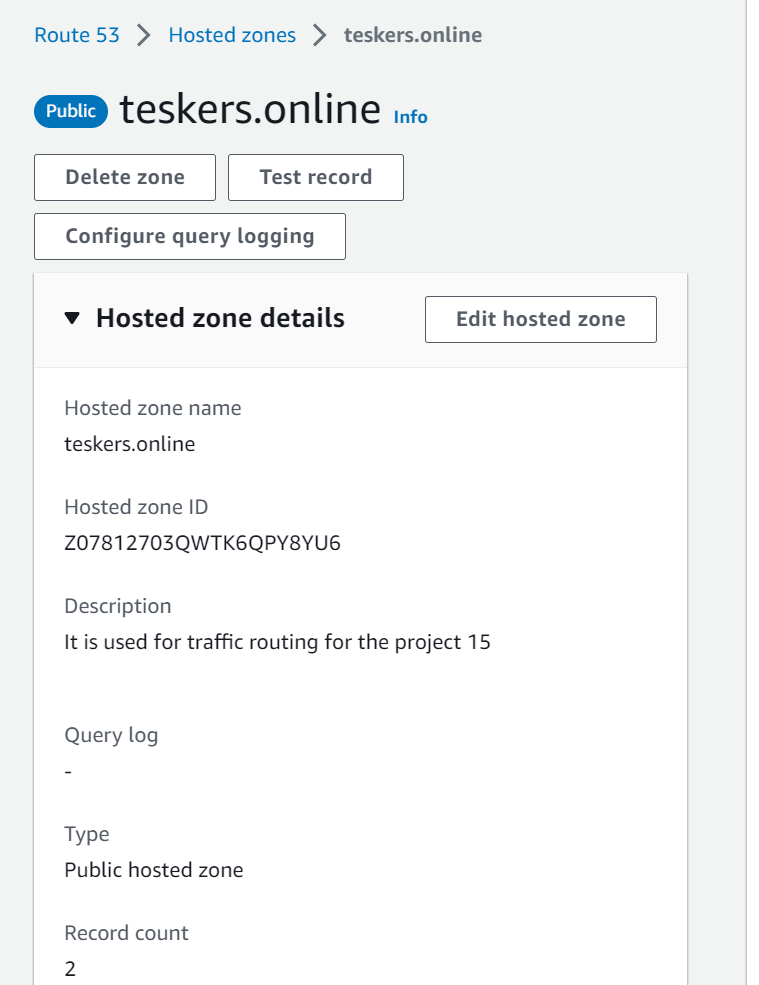

- Navigate to the certificate manager and create a certificate for your domain. This is to allow the ALB to use the certificate for the domain.
    - In creating the certificate, you would be asked to choose the domain name. Select the domain name you created earlier, ensure you use a wildcard domain name. This is to allow the certificate to be used for all subdomains. Then click on next.

    result:
    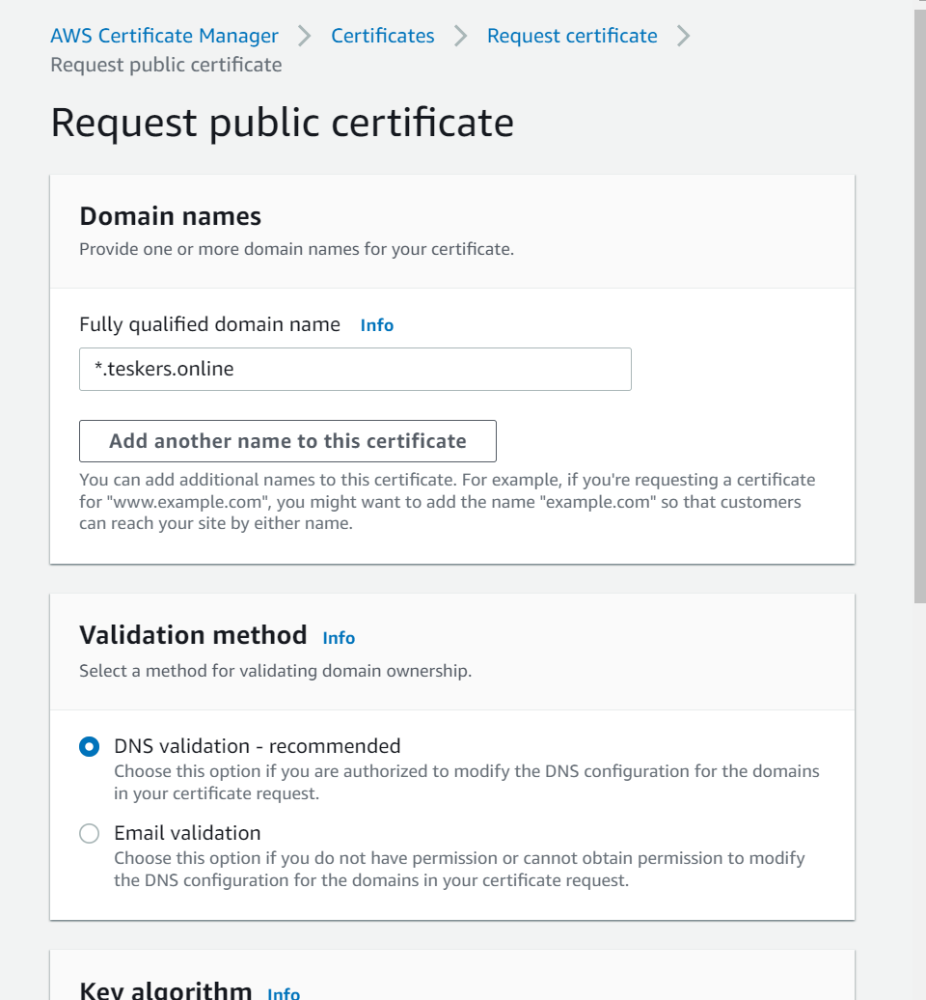

- Then click on the certificate, in the domain section you would be asked to create records in route 53. Click on create records in route 53. This is to allow the certificate to be validated.

    result:
    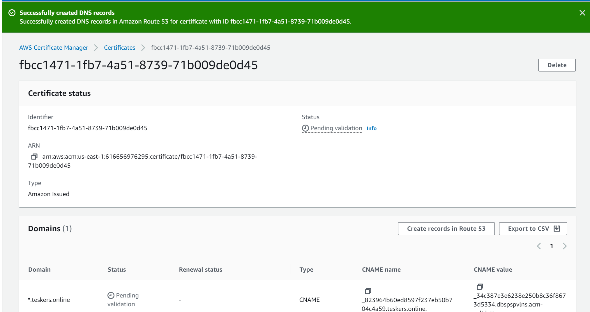

## Creating the Elastic File System (EFS)

- Now we proceed to create the Amazon Elastic File system (EFS). This is to allow the web servers to share files. Navigate to the EFS dashboard and click on create file system. Select the vpc that was earlier created and click on customize. Then click next. Here you would be asked to create mount targets. Select the subnets you want to create the mount targets in (private subnets 1&2). Remember to change the security group to datalayer security group. This is to allow the web servers to connect to the EFS. Then click next. Then click on create file system.

    result:
    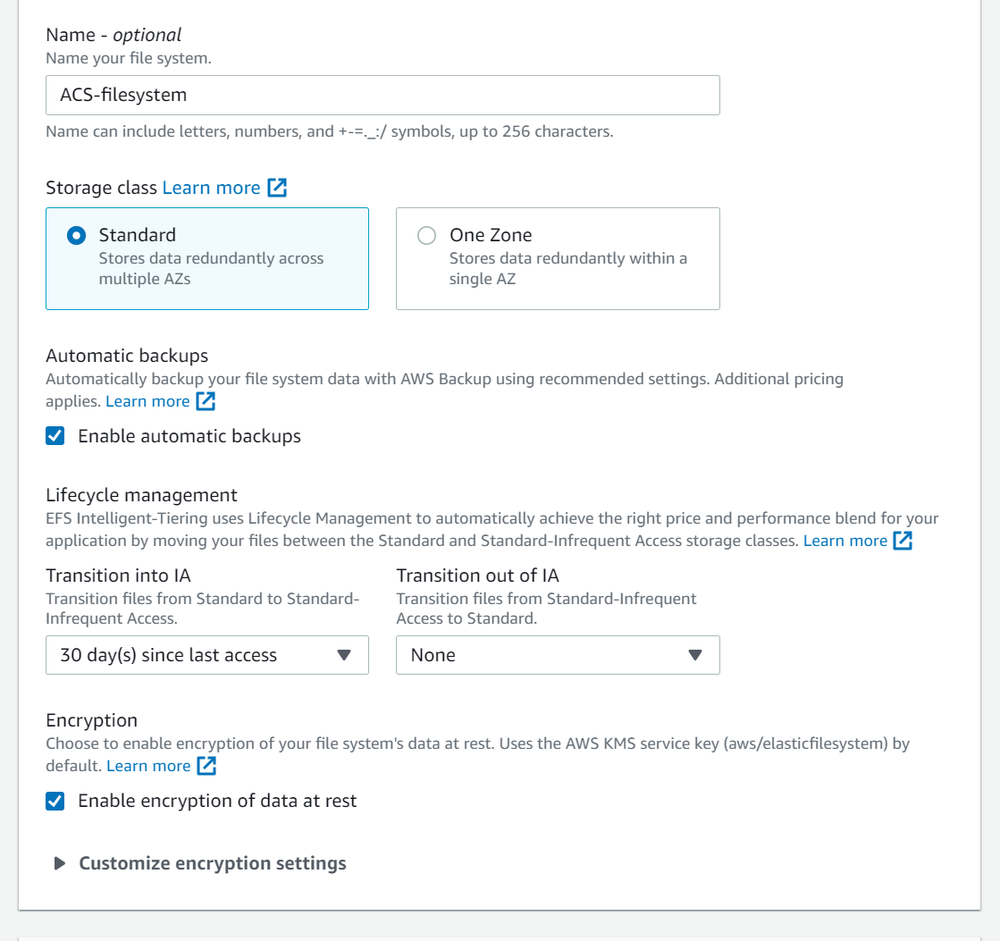

    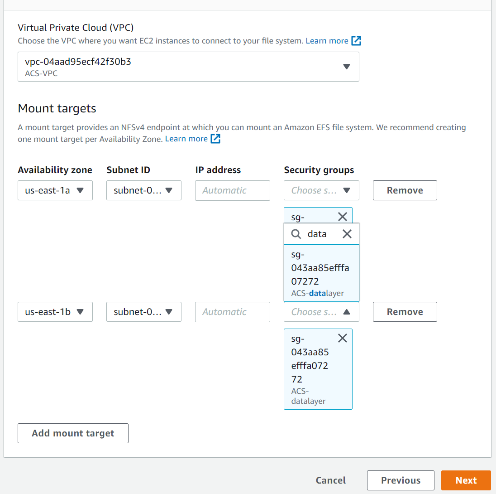

Note: According to our architecture diagram, our web servers are in private subnets 1 & 2. As they would be the ones that need to mount to the EFS.

- In our filesystem, we need to create access points. One for our tooling and the other for wordpress server. Navigate to the EFS dashboard and select the file system you created earlier. Then click on access points. Click on create an access point. 

    - specify the name of the access point.
    - specify the path of the root directory. This is to allow the access point to be used for a specific directory.
    - select the POSIX user:
        - user ID : 0
        - group ID : 0
    - select the root directory creation permissions:
        - owner ID : 0
        - group ID : 0
        - permissions: 0755

    - Repeat the above steps to create another access point for the tooling server.
    result:
    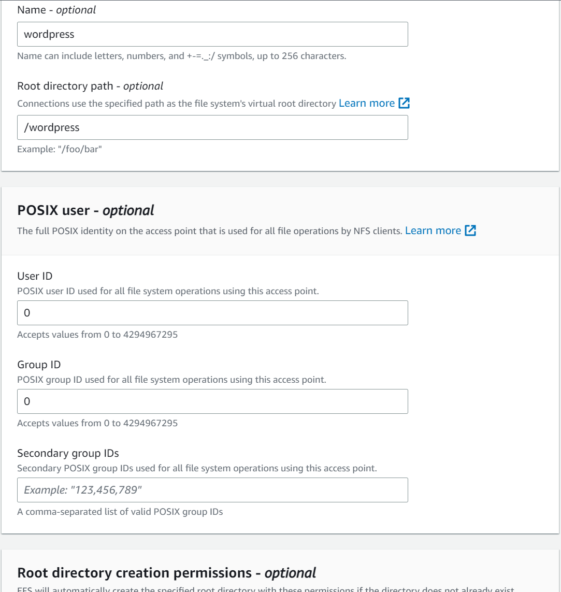
Note: The purpose of creating two access points is to prevent the case of files overwriting each other when the WordPress server and the tooling server are both writing to the same access point.


## Creating the Relational Database Service (RDS), Key Management Service (KMS) and Subnet Groups

- Let's create the KMS key. Navigate to the KMS dashboard and click on create key. 
    - select the key type as symmetric.
    - select the key usage as encrypt and decrypt.
    - click on next.
    - select a name for the key.
    - select the key administrator.(you can select your own account)
    - click on next.
    - select the key usage permission. (you can select your own account)
    - click on finish.

    result:
    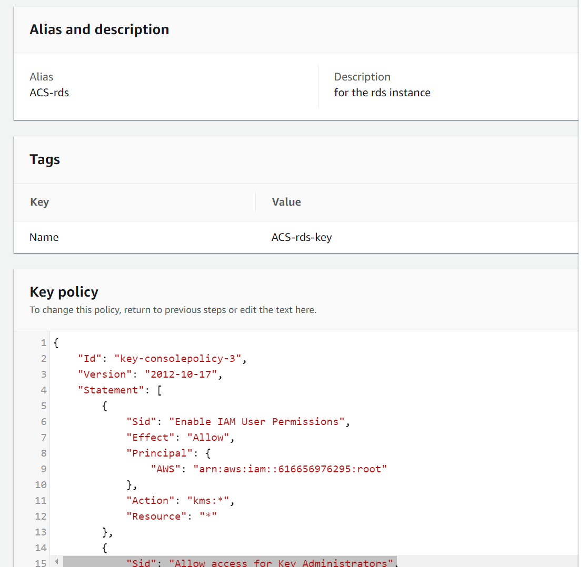

- Let's move on with creating the subnet groups. Navigate to the RDS dashboard and click on subnet groups.
    - click on create db subnet group.
    - specify the name and description of the subnet group.
    - select the vpc you created earlier.
    - select the availability zones that include the subnets you want to add. In this case, we would select us-east-1a and us-east-1b.
    - select the subnets you want to add. According to the format for assigning IP addresses our private subnets where the RDS would be created are odd-numbered. So we would be selecting the private subnets 3 & 4.
    - click on create.

    result:
    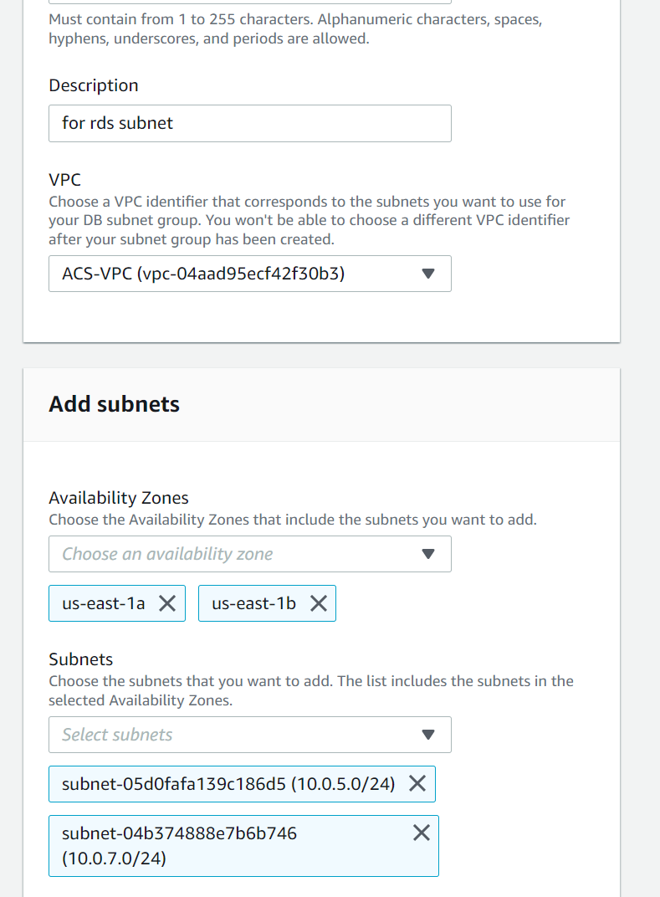

- Now we navigate back to the Amazon rds dashboard and create a database
    - click on create database.
    - select the database engine as MySQL.
    - select the latest engine version.
    - select the free tier template. The only downside to this is that we are unable to encrypt the database. As using the production template requires a huge amount of money.
    - select your db instance identifier.
    - select the master username and password. Here we used ACSadmin and admin12345 respectively.
    - select the vpc you created earlier.
    - For the public access, we would select no. This is to prevent the database from being accessed publicly.
    - For the vpc security group, we would select the datalayer security group created much earlier.
    - In the additional configuration, we would specify the initial database name as test
    - Then click on create database.

    result:
    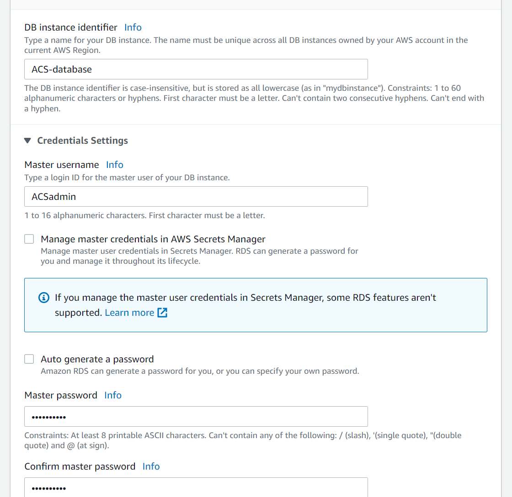


## Creating our Resources
- Target group
- Launch template
- Load balancer
- Auto scaling group

- Create our launch template. We would be creating 3 instances that we would use as our template.
    - Navigate to the EC2 dashboard and click on ec2 instances.
    - Click on launch instance.
    - Select the AMI you want to use. In this case, we would be using the RedHat linux 8 AMI.
    - Select the instance type. In this case, we would be using the t2.micro.
    - Configure the instance and change the number of instances to 3.
    - Configure the security group. Here we would be creating a new security group. We would be allowing traffic all traffic.
    - Then click on launch.

    result:
    

- Rename the 3 instances
    - bastion
    - nginx
    - webserver

    result:
    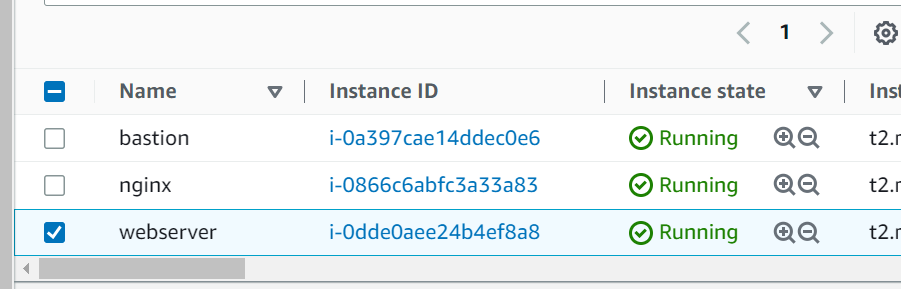

- Now we ssh into our bastion host to install the necessary packages using mobaxterm. [Here's a link to how to do this](https://www.youtube.com/watch?v=oiw1K3G06DI)
    
    result:
    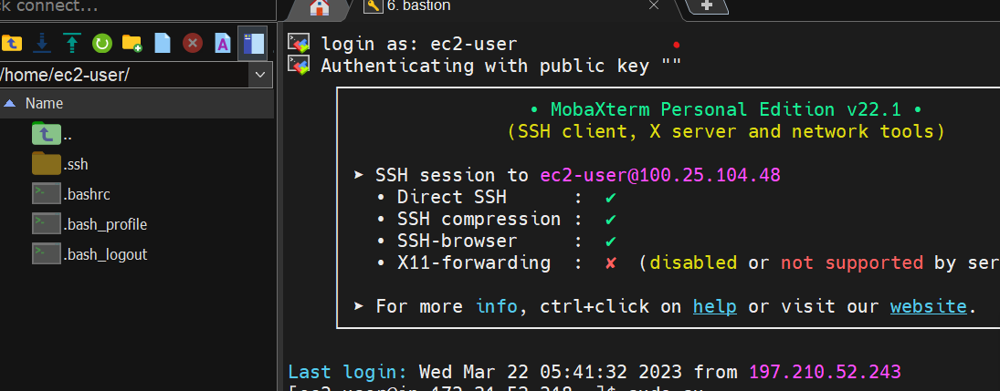


### Bastion AMI installation
- SSH into the bastion server
    - switch to root user
    - install the necessary packages
    ```bash
    yum install -y https://dl.fedoraproject.org/pub/epel/epel-release-latest-8.noarch.rpm

    yum install -y dnf-utils http://rpms.remirepo.net/enterprise/remi-release-8.rpm 

    yum install wget vim python3 telnet htop git nano mysql net-tools chrony -y 

    systemctl start chronyd 

    systemctl enable chronyd
    ```
    result:
    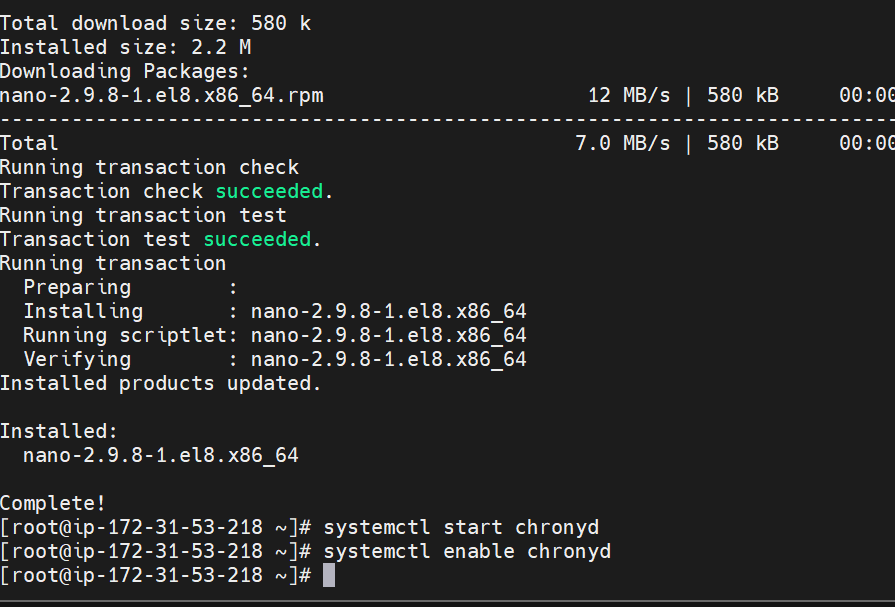


### Nginx AMI installation
- SSH into the nginx server
    - switch to root user
    ```bash
    sudo su -
    ```
    - install the necessary packages
    ```bash
    yum install -y https://dl.fedoraproject.org/pub/epel/epel-release-latest-8.noarch.rpm

    yum install -y dnf-utils http://rpms.remirepo.net/enterprise/remi-release-8.rpm

    yum install wget vim python3 telnet nano htop git mysql net-tools chrony -y

    systemctl start chronyd

    systemctl enable chronyd
    ```
    result:
    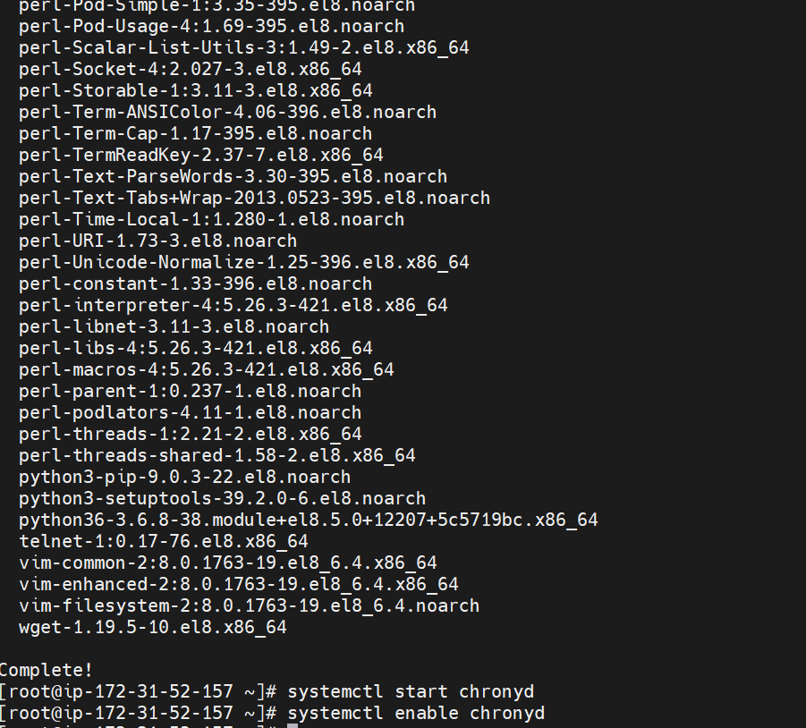

- configure selinux policies for the webservers and nginx servers
    ```bash
    setsebool -P httpd_can_network_connect=1

    setsebool -P httpd_can_network_connect_db=1

    setsebool -P httpd_execmem=1

    setsebool -P httpd_use_nfs 1
    ```
    result:
    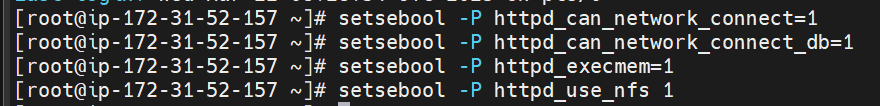

- We will install amazon EFS utils for mounting the target on the Elastic file system
    ```bash
    git clone https://github.com/aws/efs-utils

    cd efs-utils

    yum install -y make

    yum install -y rpm-build

    make rpm 

    yum install -y  ./build/amazon-efs-utils*rpm
    ```
    result:
    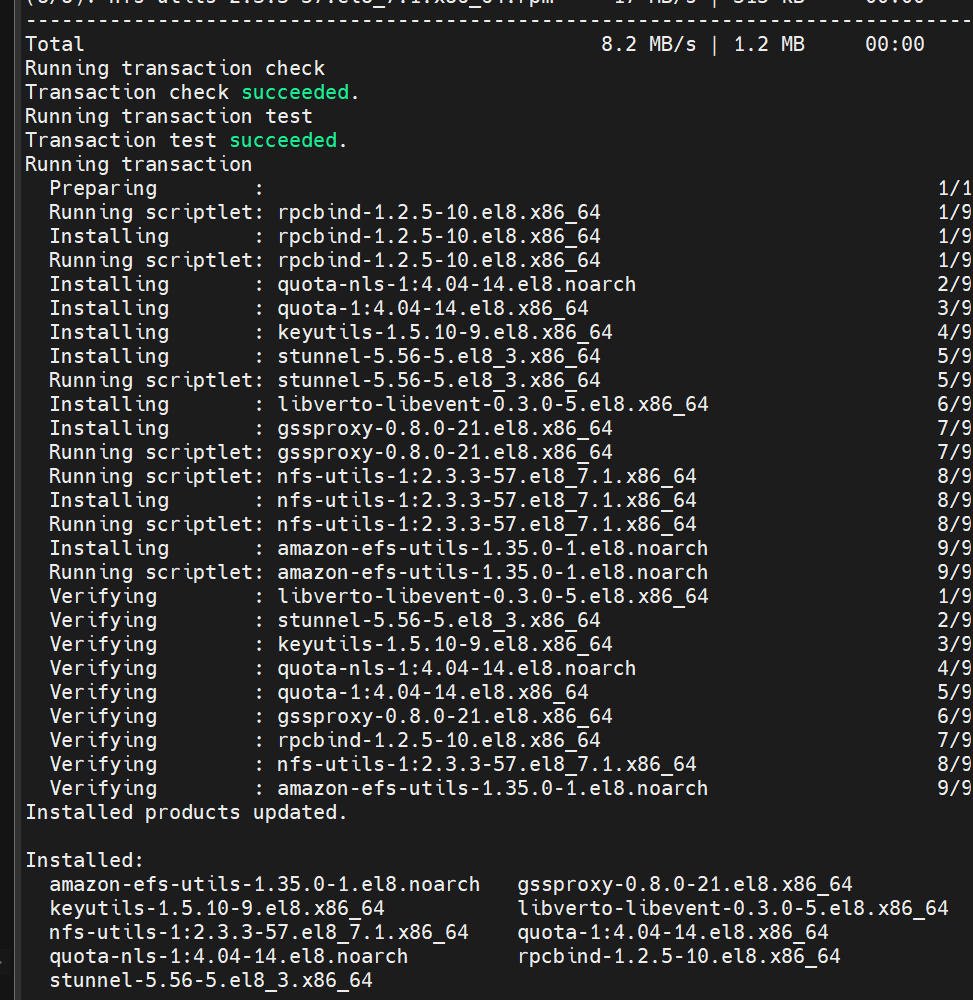

- Seting up self-signed certificate for the nginx instance
    ```bash
    sudo mkdir /etc/ssl/private

    sudo chmod 700 /etc/ssl/private

    openssl req -x509 -nodes -days 365 -newkey rsa:2048 -keyout /etc/ssl/private/ACS.key -out /etc/ssl/certs/ACS.crt

    sudo openssl dhparam -out /etc/ssl/certs/dhparam.pem 2048
    ```
        - The openssl command will prompt you to enter the following information:
            - Country Name (2 letter code) [AU]: NG
            - State or Province Name (full name) [Some-State]: Lagos
            - Locality Name (eg, city) []: Ikeja
            - Organization Name (eg, company) [Internet Widgits Pty Ltd]: ACS
            - Organizational Unit Name (eg, section) []: IT
            - Common Name (e.g. server FQDN or YOUR name) []: <nginx-server private dns>
            - Email Address []:
    result:
    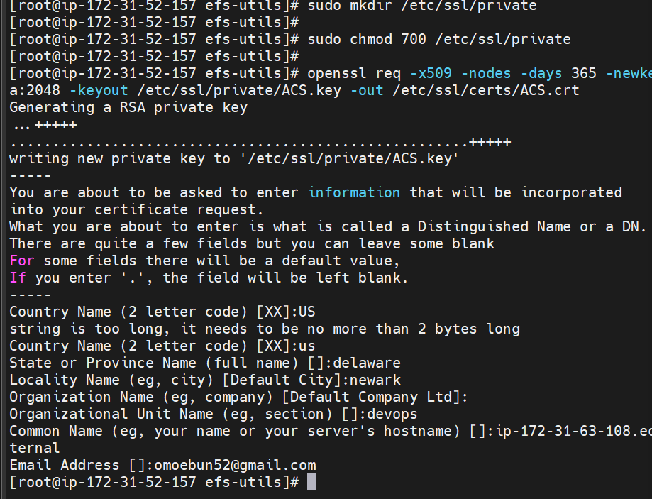

- To check if our certificate has been generated run the following command
    ```bash
    sudo ls /etc/ssl/certs/
    ```
    As we would be looking for ACS.crt.

    result:
    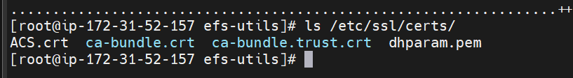


### Webserver AMI installation
- SSH into the webserver on mobaxterm
    - switch to root user
    ```bash
    sudo su -
    ```
    - install the necessary packages
        ```bash
        yum install -y https://dl.fedoraproject.org/pub/epel/epel-release-latest-8.noarch.rpm

        yum install -y dnf-utils http://rpms.remirepo.net/enterprise/remi-release-8.rpm

        yum install wget vim python3 telnet htop nano git mysql net-tools chrony -y

        systemctl start chronyd

        systemctl enable chronyd
        ```
        result:
        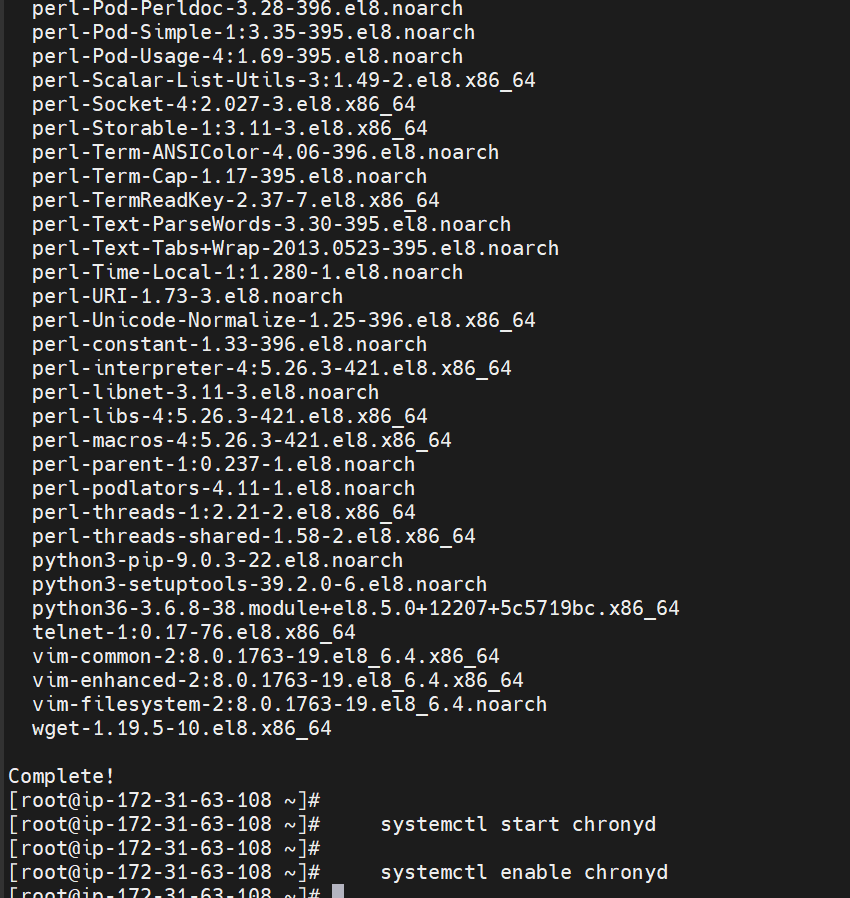

- configure selinux policies for the webservers and nginx servers
    ```bash
    setsebool -P httpd_can_network_connect=1

    setsebool -P httpd_can_network_connect_db=1

    setsebool -P httpd_execmem=1

    setsebool -P httpd_use_nfs 1
    ```
    result:
    

- We will install amazon EFS utils for mounting the target on the Elastic file system
    ```bash
    git clone https://github.com/aws/efs-utils

    cd efs-utils

    yum install -y make

    yum install -y rpm-build

    make rpm 

    yum install -y  ./build/amazon-efs-utils*rpm
    ```
    result:
    

- Setting up self-signed certificate for the apache webserver instance
    ```bash
    yum install -y mod_ssl

    openssl req -newkey rsa:2048 -nodes -keyout /etc/pki/tls/private/ACS.key -x509 -days 365 -out /etc/pki/tls/certs/ACS.crt
    ```
    - The openssl command will prompt you to enter the following information:
        - Country Name (2 letter code) [AU]: NG
        - State or Province Name (full name) [Some-State]: Lagos
        - Locality Name (eg, city) []: Ikeja
        - Organization Name (eg, company) [Internet Widgits Pty Ltd]: ACS
        - Organizational Unit Name (eg, section) []: IT
        - Common Name (e.g. server FQDN or YOUR name) []: <nginx-server private dns>
        - Email Address []:

    result:
    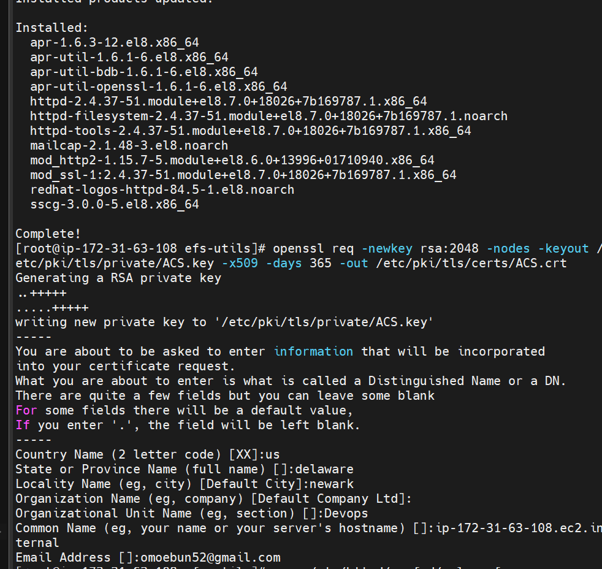

- Let's edit the ssl.conf file and change the following lines
    - The location of the certificate and key files
    ```bash
    nano /etc/httpd/conf.d/ssl.conf
    ```
    result:
    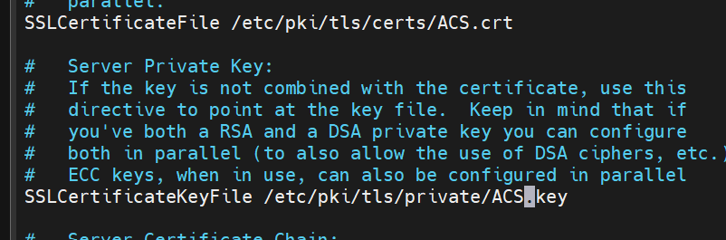

    
### Creating our AMI images
- select the webserver instance and click on actions > image > create image
    - give the image a name and description
    - click on create image
    result:
    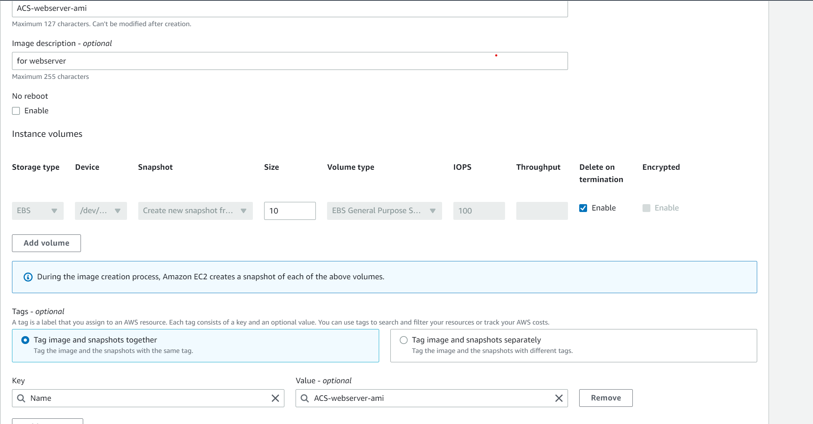

- Repeat the same process for bastion and nginx instances.

### Creating our Target groups
    
- Create target group for nginx
    - Click on load balancing > target groups > create target group
    - Select the target type: instance.
    - specify your target group name: ACS-nginx-target.
    - select the protocol: HTTPS.
    - select the port: 443.
    - select the vpc: the one you created earlier (ACS-VPC).
    - specify the health check protocol: HTTPS.
    - specify the check path: /healthstatus
    - specify the tag
    - click on next
    - click on create target group

    result:
    

- Repeat the process for wordpress and tooling target groups

We should have the following target groups:
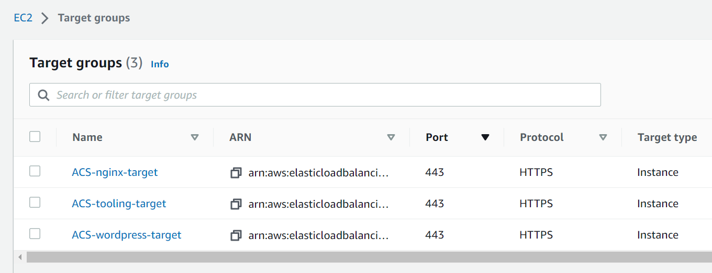

### Creating our Load balancers
- We would move on to creating the external load balancer that communicates with Nginx for us. Navigate to Load balancers > click create load balancer
    - select the load balancer type: Application load balancer.
    - Click create.
    - Specify the name: ACS-ext-ALB.
    - select the scheme: internet-facing.
    - select the ip address type: ipv4.
    - select the vpc: the one you created earlier (ACS-VPC).
    - select the subnets: the public subnets you created earlier.
    - select the security group: the one you created earlier (ACS-ext-ALB).
    - routing: 
        - protocol: HTTPS
        - port: 443
        - default action: forward to acs-nginx-target
    - ssl certificate:
        - select from ACM: the one you created earlier from ACM
    - click on create load balancer

    result:
    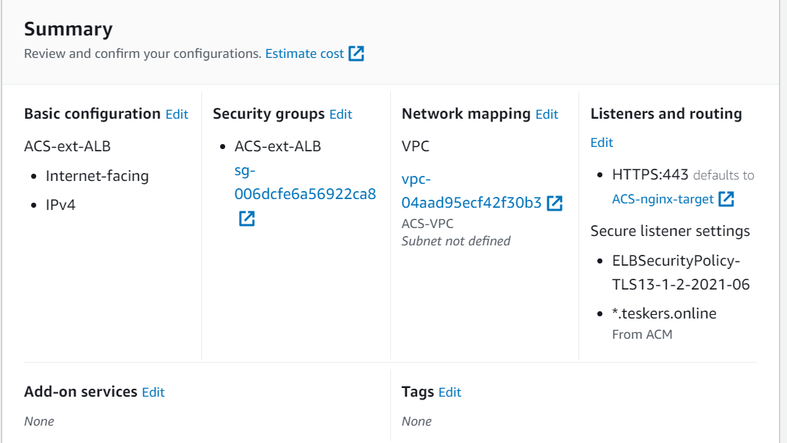

- The next step is to create the internal load balancer
    - Navigate to Load balancers > click create load balancer
    - select the load balancer type: Application load balancer.
    - Click create.
    - Specify the name: ACS-int-ALB.
    - select the scheme: internal.
    - select the ip address type: ipv4.
    - select the vpc: the one you created earlier (ACS-VPC).
    - select the subnets: the private subnets you created earlier (private subnet 1&2 as they are the ones connected to the internal load balancer according to the architecture diagram).
    - select the security group: the one you created earlier (ACS-int-ALB).
    - routing: 
        - protocol: HTTPS
        - port: 443
        - default action: forward to acs-wordpress-target
    - ssl certificate:
        - select from ACM: the one you created earlier from ACM
    - click on create load balancer

    result:
    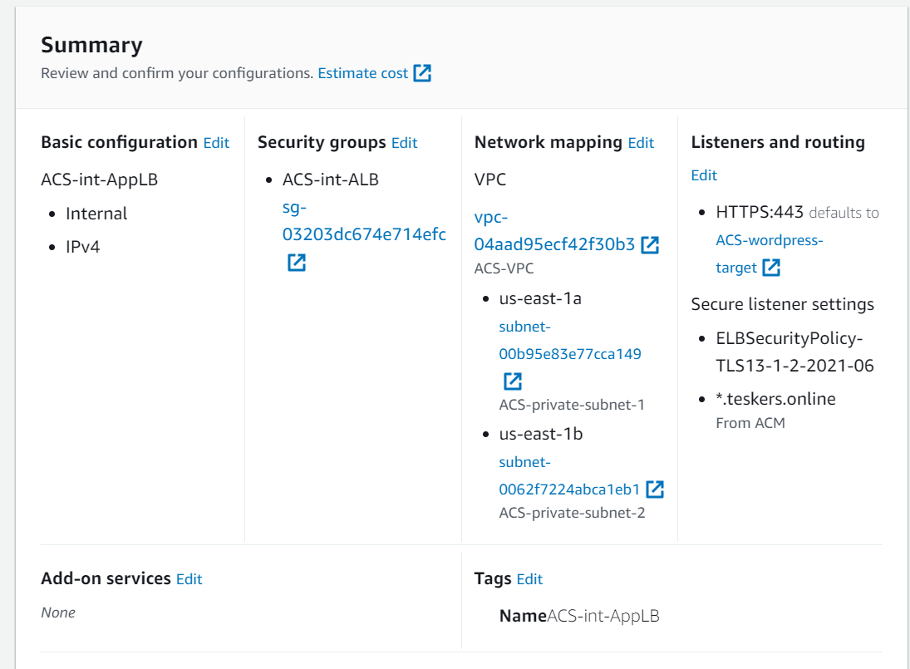

- We also need to ensure that the internal load balancer can communicate with the tooling target group. To do this:
    - select the internal load balancer and click on listeners
    - click on rules under the listener rules 
    - click on create rule to tell the load balancer to check for the host header with the name tooling and forward the request to the tooling target group
    - click on save

    result:
    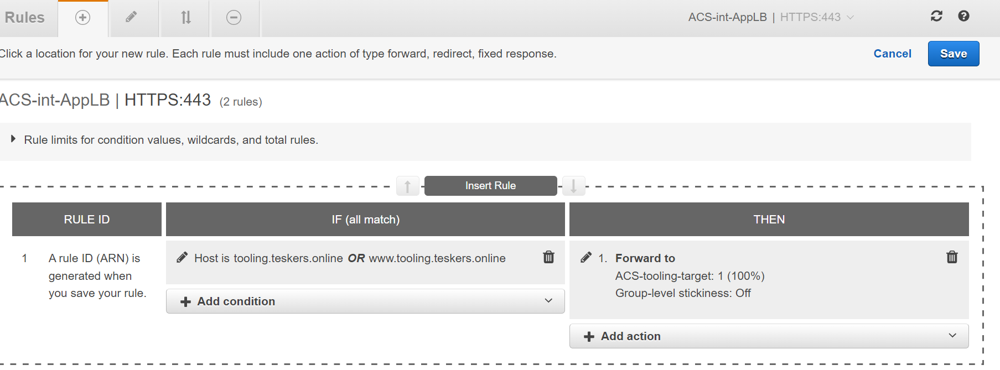

### Creating our Launch Templates
- We would now move on to creating our launch templates. Launch templates are used to create instances with the same configuration. This is very useful when you want to create multiple instances with the same configuration.

- We would be creating the launch templates for the bastion
    - Navigate to EC2 > launch templates > create launch template
    - specify your launch template name
    - select the AMI: the one you created earlier: <bastion> instance
    - select the instance type: t2.micro
    - select your key pair: the one you created earlier
    - select your subnet: the public subnet you created earlier(public subnet 2)
    - under advanced network configurations:
        - select your security group: the one you created earlier (ACS-bastion)
        - enable auto assign public ip
    - under advanced details:
        - In the user data field, paste the following script:
        ```bash
        #!/bin/bash 
        yum install -y mysql 
        yum install -y git tmux 
        yum install -y ansible
        ```
    - click on create launch template

    result:
    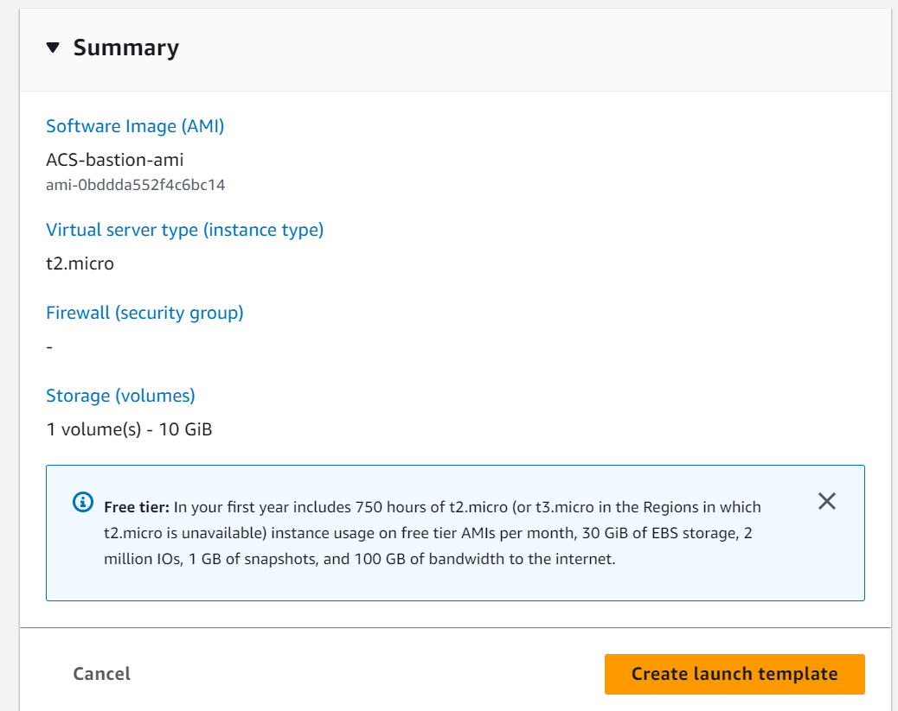

- Then we would be creating the launch template for nginx
    - Navigate to EC2 > launch templates > create launch template
    - specify your launch template name
    - select the AMI: the one you created earlier: <nginx> instance
    - select the instance type: t2.micro
    - select your key pair: the one you created earlier
    - select your subnet: the public subnet you created earlier(public subnet 1)
    - under advanced network configurations:
        - select your security group: the one you created earlier (ACS-nginx-reverse-proxy)
        - enable auto assign public ip
    - under advanced details:
        - In the user data field, paste the following script:
        ```bash 
        #!/bin/bash
        yum install -y nginx
        systemctl start nginx
        systemctl enable nginx
        git clone https://github.com/manny-uncharted/ACS-project-config.git
        mv /ACS-project-config/reverse.conf /etc/nginx/
        mv /etc/nginx/nginx.conf /etc/nginx/nginx.conf-distro
        cd /etc/nginx/
        touch nginx.conf
        sed -n 'w nginx.conf' reverse.conf
        systemctl restart nginx
        rm -rf reverse.conf
        rm -rf /ACS-project-config
        ```
    - click on create launch template

    result:
    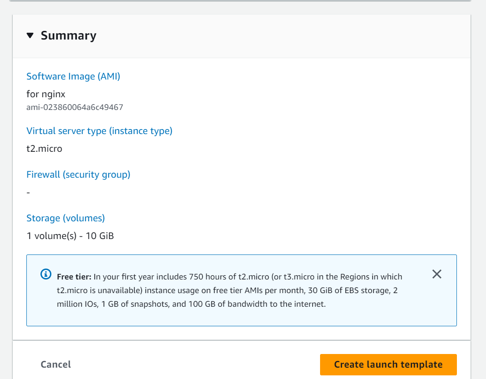
Note: Remember to replace the proxy_pass url with the internal load balancer url in the reverse.conf file that's present in the github repository.

result:
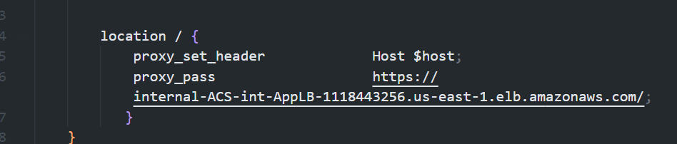

- Then we would be creating the launch template for wordpress
    - Navigate to EC2 > launch templates > create launch template
    - specify your launch template name
    - select the AMI: the one you created earlier: <webserver> instance
    - select the instance type: t2.micro
    - select your key pair: the one you created earlier
    - select your subnet: the private subnet you created earlier(private subnet 1)
    - under advanced network configurations:
        - select your security group: the one you created earlier (ACS-webserver)
        - disable auto assign public ip
    - under advanced details:
        - In the user data field, paste the following script:
        ```bash 
        #!/bin/bash
        mkdir /var/www/
        sudo mount -t efs -o tls,accesspoint=fsap-03782096eef2189e5 fs-064a0aac15a1f90dd:/ /var/www/
        yum install -y httpd 
        systemctl start httpd
        systemctl enable httpd
        yum module reset php -y
        yum module enable php:remi-7.4 -y
        yum install -y php php-common php-mbstring php-opcache php-intl php-xml php-gd php-curl php-mysqlnd php-fpm php-json
        systemctl start php-fpm
        systemctl enable php-fpm
        wget http://wordpress.org/latest.tar.gz
        tar xzvf latest.tar.gz
        rm -rf latest.tar.gz
        cp wordpress/wp-config-sample.php wordpress/wp-config.php
        mkdir /var/www/html/
        cp -R /wordpress/* /var/www/html/
        cd /var/www/html/
        touch healthstatus
        sed -i "s/localhost/acs-database.crdwcrqpgnyb.us-east-1.rds.amazonaws.com/g" wp-config.php 
        sed -i "s/username_here/ACSadmin/g" wp-config.php 
        sed -i "s/password_here/admin12345/g" wp-config.php 
        sed -i "s/database_name_here/wordpressdb/g" wp-config.php 
        chcon -t httpd_sys_rw_content_t /var/www/html/ -R
        systemctl restart httpd
        ```

Note: For the userdata config we need the following information 

- The Wordpress access point from the Elastic File System
    - Navigate to EFS > click on access points
    - Select the wordpress access point
    - click on attach 
    - copy the access point mount comand provided

    result:
    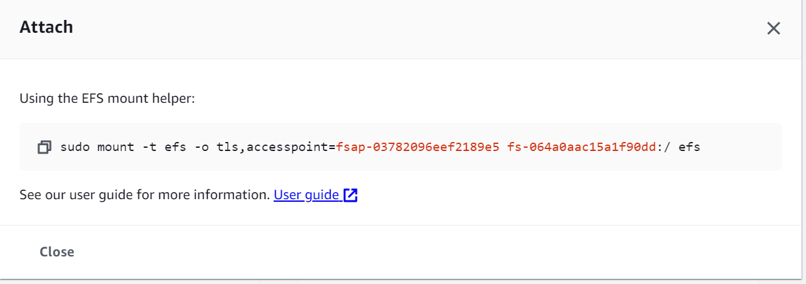
- The database endpoint from the RDS instance
    - Navigate to RDS > click on the database instance (acs-database)
    - copy the endpoint provided

    result:
    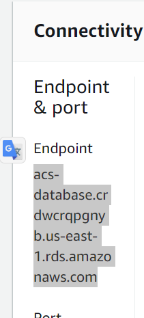

    
- click on create launch template

result:
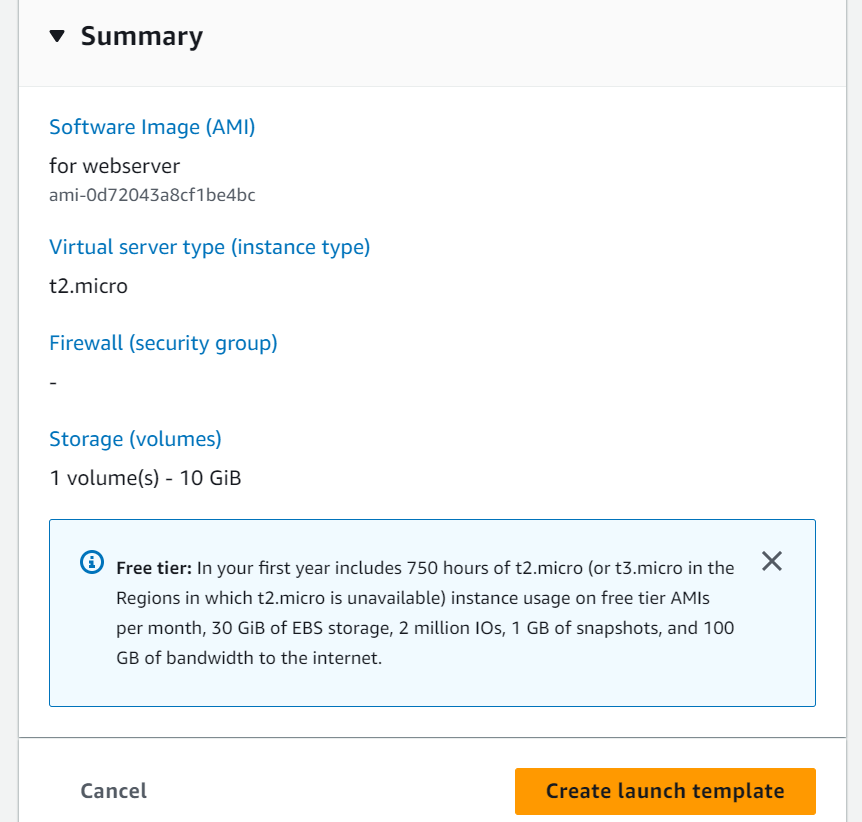

- We would then move on to creating the launch templates for the tooling instances
    - Navigate to EC2 > launch templates > create launch template
    - specify your launch template name
    - select the AMI: the one you created earlier: <tooling> instance
    - select the instance type: t2.micro
    - select your key pair: the one you created earlier
    - select your subnet: the private subnet you created earlier(private subnet 2)
    - under advanced network configurations:
        - select your security group: the one you created earlier (ACS-tooling)
        - disable auto assign public ip
    - under advanced details:
        - In the user data field, paste the following script:
        ```bash 
        #!/bin/bash
        mkdir /var/www/
        sudo mount -t efs -o tls,accesspoint=fsap-07f76f49862020352 fs-064a0aac15a1f90dd:/ /var/www/
        yum install -y httpd 
        systemctl start httpd
        systemctl enable httpd
        yum module reset php -y
        yum module enable php:remi-7.4 -y
        yum install -y php php-common php-mbstring php-opcache php-intl php-xml php-gd php-curl php-mysqlnd php-fpm php-json
        systemctl start php-fpm
        systemctl enable php-fpm
        git clone https://github.com/manny-uncharted/tooling.git
        mkdir /var/www/html
        cp -R /tooling-1/html/*  /var/www/html/
        cd /tooling-1
        mysql -h acs-database.crdwcrqpgnyb.us-east-1.rds.amazonaws.com -u ACSadmin -p toolingdb < tooling-db.sql
        cd /var/www/html/
        touch healthstatus
        sed -i "s/$db = mysqli_connect('mysql.tooling.svc.cluster.local', 'admin', 'admin', 'tooling');/$db = mysqli_connect('acs-database.crdwcrqpgnyb.us-east-1.rds.amazonaws.com', 'ACSadmin', 'admin12345', 'toolingdb');/g" functions.php
        chcon -t httpd_sys_rw_content_t /var/www/html/ -R
        systemctl restart httpd
        ```

Note: For the userdata config we need the following information 

- The tooling access point from the Elastic File System
    - Navigate to EFS > click on access points
    - Select the tooling access point
    - click on attach 
    - copy the access point mount command provided

    result:
    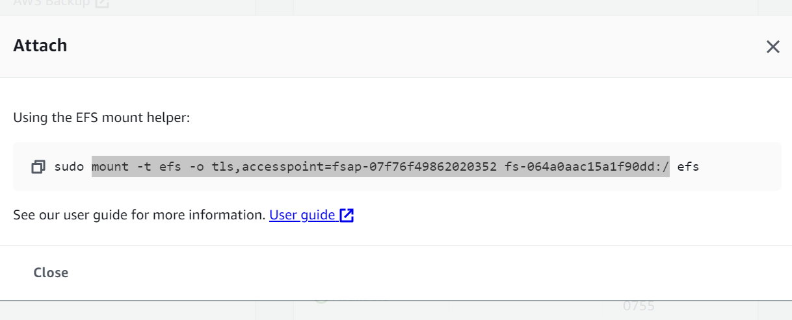
- The database endpoint from the RDS instance
    - Navigate to RDS > click on the database instance (acs-database)
    - copy the endpoint provided
    
    result:
    

- click on create launch template

result:
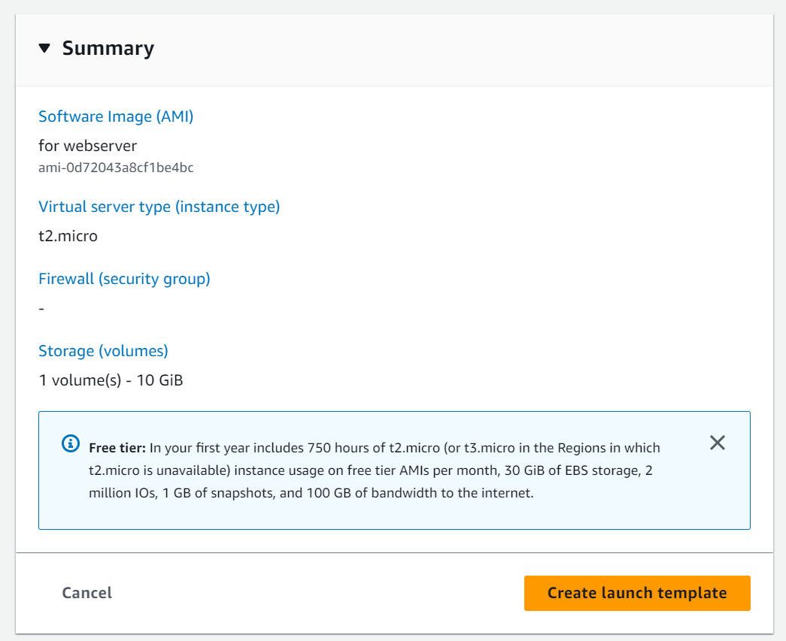


### Creating the Autoscaling Groups

- Now we would move on to creating Autoscaling group for the bastion
    - Navigate to EC2 > Autoscaling > create autoscaling group
    - specify your autoscaling group name: ACS-bastion-as
    - select your launch template: the one you created earlier (ACS-bastion-template)
    - click on next
    - select your VPC: the one you created earlier (ACS-VPC)
    - select your subnet: the public subnet you created earlier (public subnet 1 & 2)
    - click on next
    - Under load balancing: select no load balancer (as the bastion servers are not under load balancers according to the architecture)
    - Under health check: select ELB status check
    - Under scaling policies: select Target tracking scaling
        - specify target value: 90
    - click on next
    - Create a Notification
        - specify your topic: (ACS-Notification)
        - select all events
    - click on next
    - Under tags: select add tag
        - specify your tag: Name
        - specify your value: ACS-bastion-as
    - click on next
    - click on create autoscaling group

result:
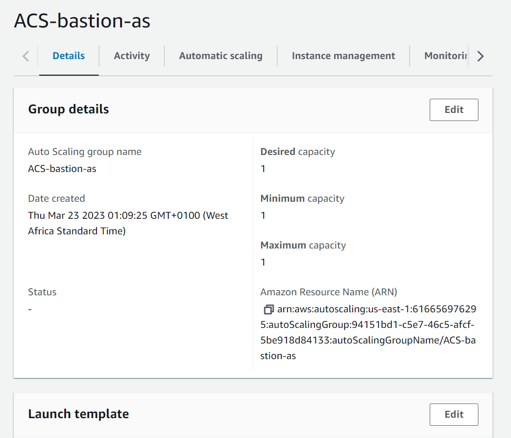

- Now we would move on to creating Autoscaling group for the nginx servers
    - Navigate to EC2 > Autoscaling > create autoscaling group
    - specify your autoscaling group name: ACS-nginx-as
    - select your launch template: the one you created earlier (ACS-nginx-template)
    - click on next
    - select your VPC: the one you created earlier (ACS-VPC)
    - select your subnet: the public subnet you created earlier (public subnet 1 & 2)
    - click on next
    - Under load balancing: select attach to an existing load balancer
        - select your load balancer: the one you created earlier (ACS-nginx-target)
    - Under health check: select ELB status check
    - Under scaling policies: select Target tracking scaling
        - specify target value: 90
    - click on next
    - Create a Notification
        - specify your topic: (ACS-Notification)
        - select all events
    - click on next
    - Under tags: select add tag
        - specify your tag: Name
        - specify your value: ACS-nginx-as
    - click on next
    - click on create autoscaling group

result:
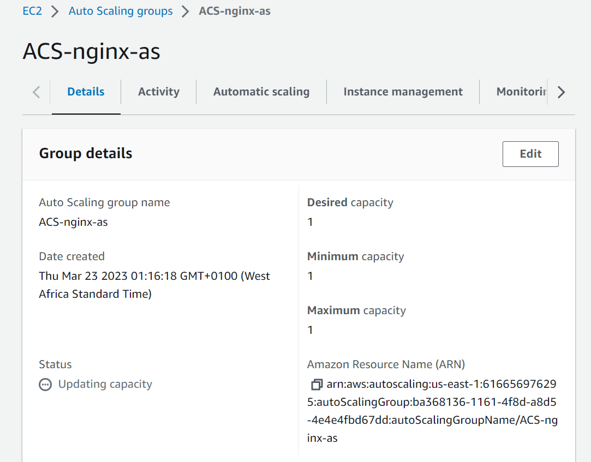

- Navigate to you ec2 dashboard and select the instances tab
    - select the instances
    - take the ip address of the ACS-bastion-as instance.
    - ssh into the instance using the key pair you created earlier 
    - We want to login to mysql on the rds through the bastion server
    - run the following command:
    ```bash
    mysql -h <rds-endpoint> -u ACSadmin -p 
    ```
    - enter the password you created earlier
    - We would be creating the wordpress and tooling database on the rds instance
    - run the following commands:
    ```bash
    create database wordpressdb;
    create database toolingdb;
    show databases;
    ```
    - Then you can exit the rds

result:
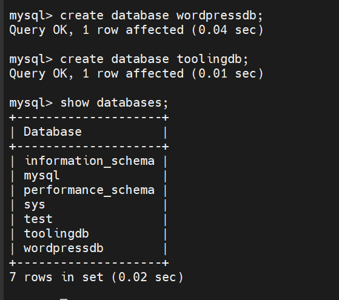

- Now we move on to creating an auto scaling group for the wordpress servers
    - Navigate to EC2 > Autoscaling > create autoscaling group
    - specify your autoscaling group name: ACS-wordpress-as
    - select your launch template: the one you created earlier (ACS-wordpress-template)
    - click on next
    - select your VPC: the one you created earlier (ACS-VPC)
    - select your subnet: the private subnet you created earlier (private subnet 1 & 2)
    - click on next
    - Under load balancing: select attach to an existing load balancer
        - select your load balancer: the one you created earlier (ACS-wordpress-target)
    - Under health check: select ELB status check
    - Under scaling policies: select Target tracking scaling
        - specify target value: 90
    - click on next
    - Create a Notification
        - specify your topic: (ACS-Notification)
        - select all events
    - click on next
    - Under tags: select add tag
        - specify your tag: Name
        - specify your value: ACS-wordpress-as
    - click on next
    - click on create autoscaling group

result:
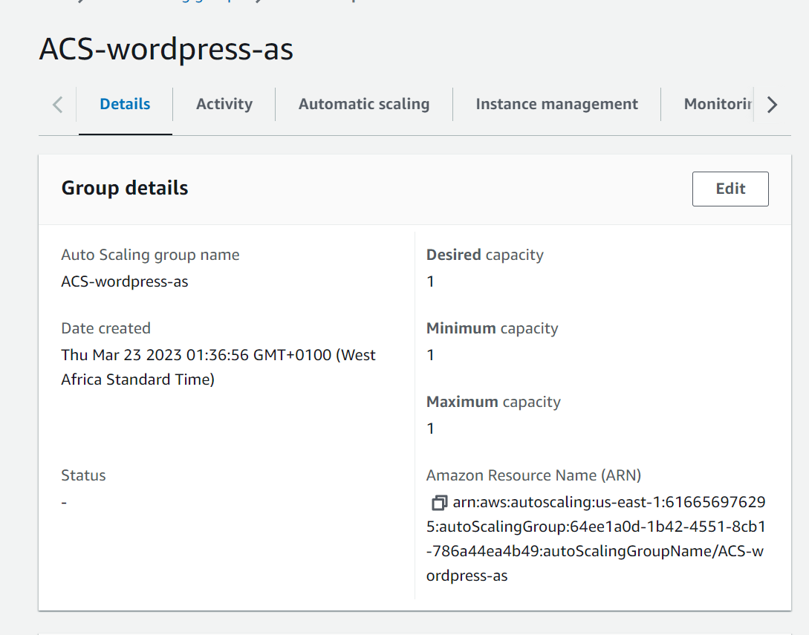

- We would also move on to creating an auto scaling group for the tooling servers
    - Navigate to EC2 > Autoscaling > create autoscaling group
    - specify your autoscaling group name: ACS-tooling-as
    - select your launch template: the one you created earlier (ACS-tooling-template)
    - click on next
    - select your VPC: the one you created earlier (ACS-VPC)
    - select your subnet: the private subnet you created earlier (private subnet 1 & 2)
    - click on next
    - Under load balancing: select attach to an existing load balancer
        - select your load balancer: the one you created earlier (ACS-tooling-target)
    - Under health check: select ELB status check
    - Under scaling policies: select Target tracking scaling
        - specify target value: 90
    - click on next
    - Create a Notification
        - specify your topic: (ACS-Notification)
        - select all events
    - click on next
    - Under tags: select add tag
        - specify your tag: Name
        - specify your value: ACS-tooling-as
    - click on next
    - click on create autoscaling group

result:
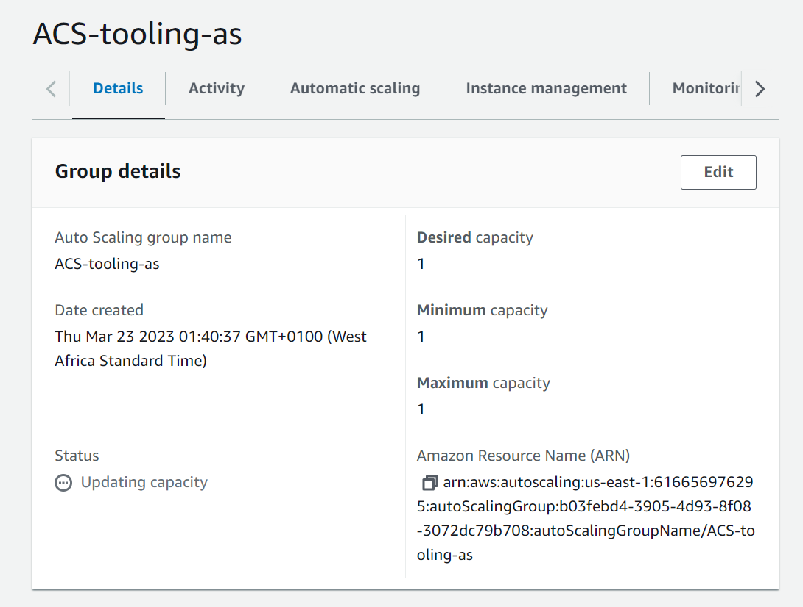

### Creating the Route53 records
It's time for us to create the route53 records for the load balancers

- Navigate to Route53 > Hosted zones > create hosted zone > select your previously created hosted zone > click on add records

- For tooling 
    - specify your record name: tooling
    - check the alias box
    - Route traffic to: Alias to Application Load Balancer
    - Choose region: select the region you created your load balancer in (us-east-1)
    - select your load balancer: the application ext load balancer (ACS-ext-AppLB)
- The same process applies to the wordpress.

result:
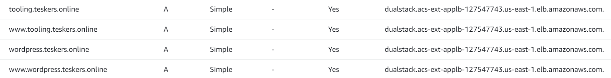
