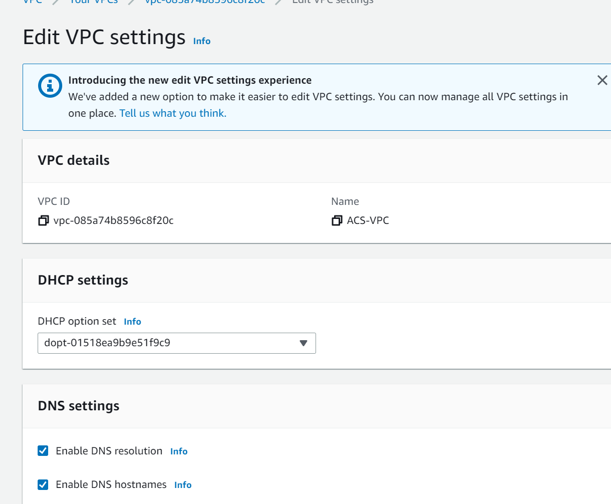
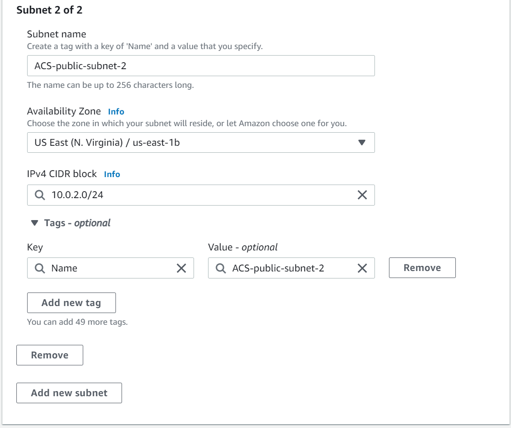
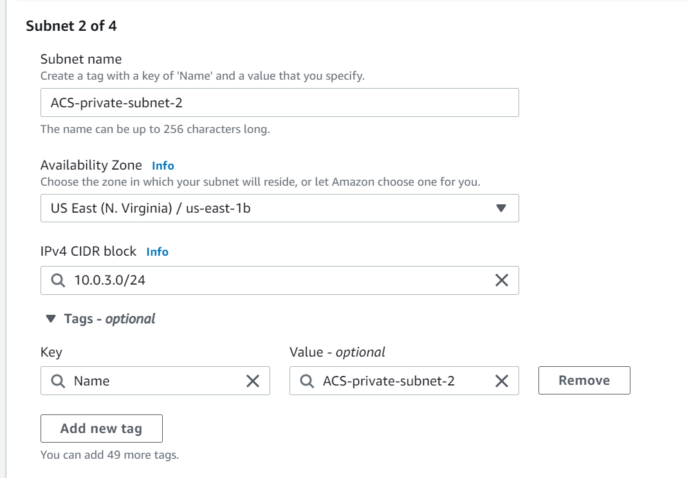
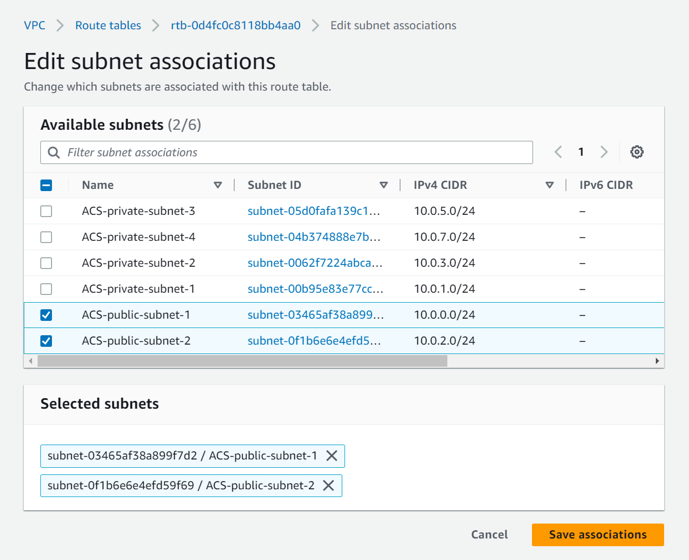
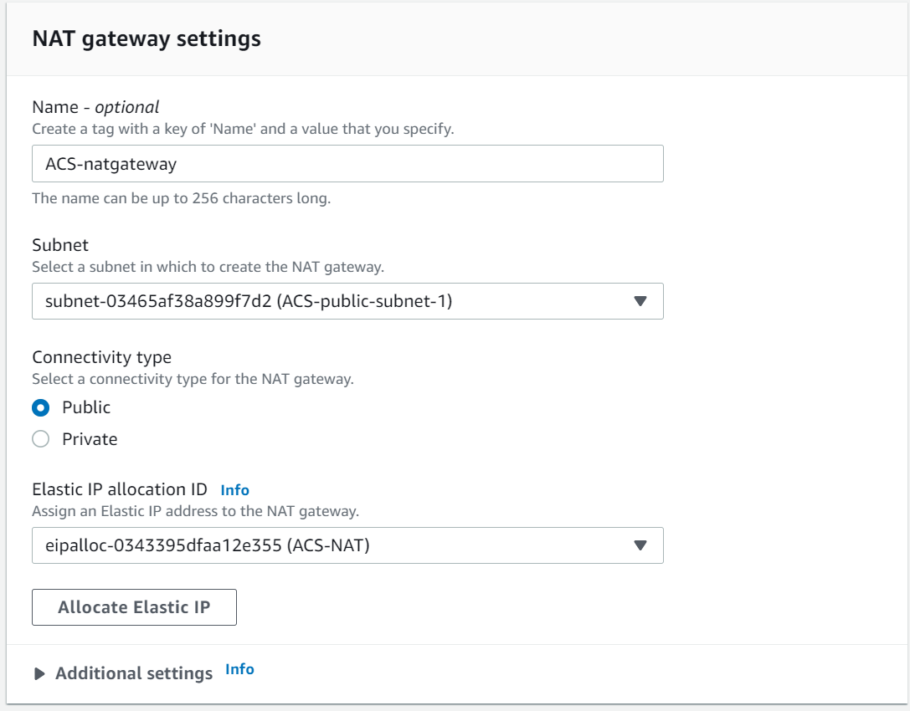
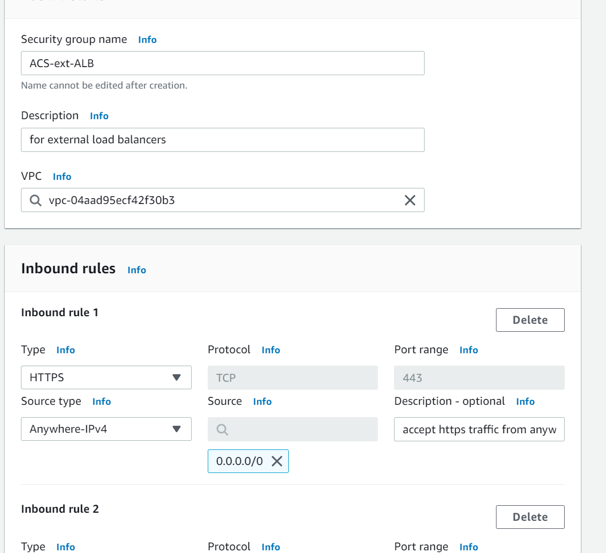
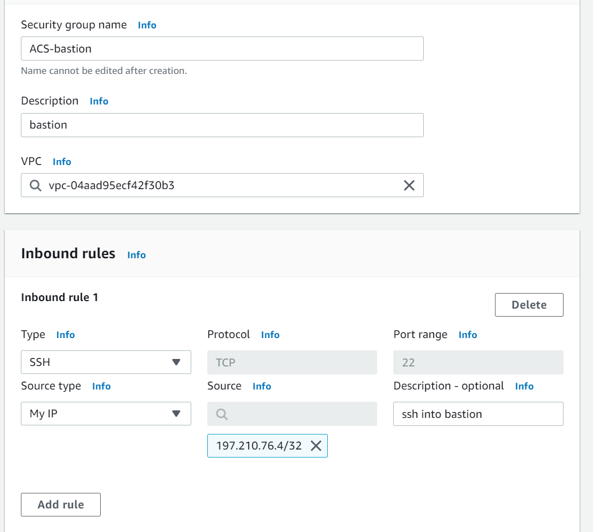
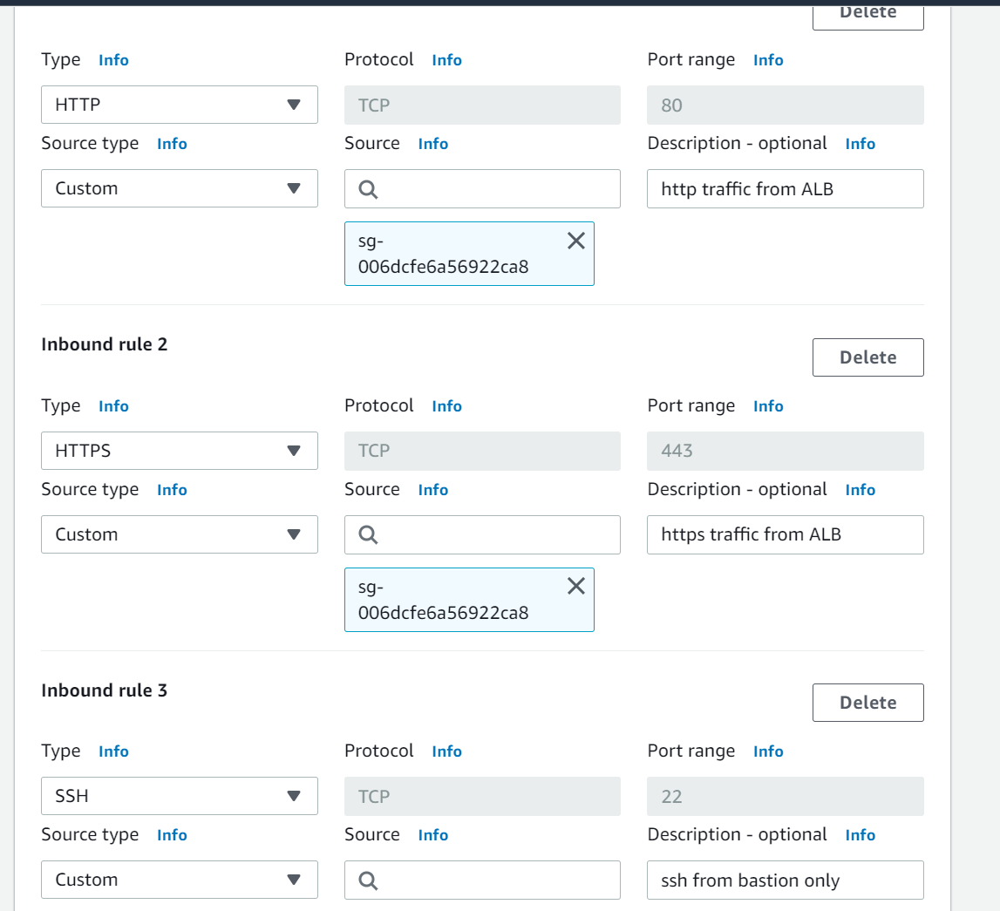
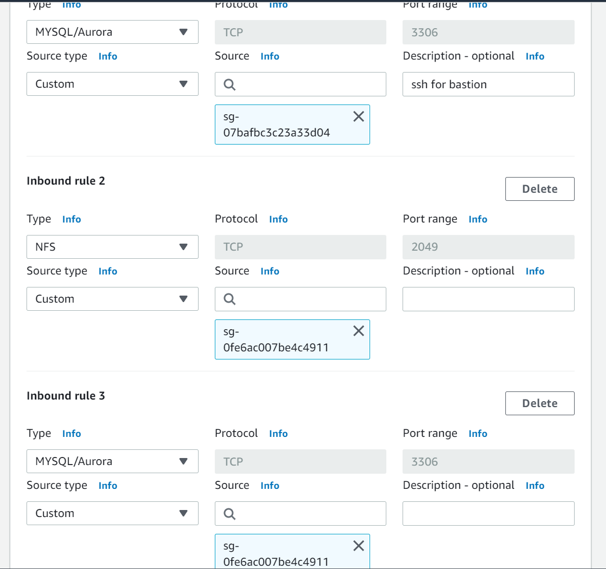

# AWS CLOUD SOLUTION FOR 2 COMPANY WEBSITES USING A REVERSE PROXY TECHNOLOGY

## Table of Contents
- [Introduction](#introduction)
- [Starting Off Your AWS Cloud Project](#starting-off-your-aws-cloud-project)
- [SET UP A VIRTUAL PRIVATE NETWORK (VPC)](#set-up-a-virtual-private-network-vpc)

## Introduction
In this project, you will build a secure infrastructure inside AWS VPC (Virtual Private Cloud) network for a fictitious company (Choose an interesting name for it) that uses WordPress CMS for its main business website, and a Tooling Website (https://github.com/manny-uncharted/tooling) for their DevOps team. As part of the company’s desire for improved security and performance, a decision has been made to use a reverse proxy technology from NGINX to achieve this.

Cost, Security, and Scalability are the major requirements for this project. Hence, implementing the architecture designed below, ensure that infrastructure for both websites, WordPress and Tooling, is resilient to Web Server’s failures, can accomodate to increased traffic and, at the same time, has reasonable cost.

## Starting Off Your AWS Cloud Project
There are few requirements that must be met before you begin:

1. Properly configure your AWS account and Organization Unit [Watch How To Do This Here](https://youtu.be/9PQYCc_20-Q)

    - Create an AWS Master account. (Also known as Root Account).
    - Within the Root account, create a sub-account and name it DevOps. (You will need another email address to complete this)

    Note: For a newly created account you might need to configure AWS service quota to allow you to create more accounts on the root account. [Read how to do this here](https://aws.amazon.com/premiumsupport/knowledge-center/organizations-account-exceeded/#:~:text=Resolution,Line%20Interface%20(AWS%20CLI).)
    
    result:
    
    - Within the Root account, create an AWS Organization Unit (OU). Name it Dev. (We will launch Dev resources in there)
    
    result:
    
    - Move the DevOps account into the Dev OU.

    result:
    
    - Login to the newly created AWS account using the new email address.
2. Create a free domain name for your fictitious company at Freenom domain registrar [here](https://www.freenom.com/).

3. Create a hosted zone in AWS, and map it to your free domain from Freenom. [This gives a guide on how to do this](https://youtu.be/IjcHp94Hq8A)

## SET UP A VIRTUAL PRIVATE NETWORK (VPC)
A VPC is a virtual network that you can define within AWS. It is logically isolated from other virtual networks in the AWS Cloud. You can launch your AWS resources, such as Amazon EC2 instances, into your VPC. You can specify an IP address range for the VPC, add subnets, associate security groups, and configure route tables. You can also create an Internet gateway and attach it to your VPC so that instances have access to the Internet. For more information, see [Amazon VPC User Guide](https://docs.aws.amazon.com/vpc/latest/userguide/what-is-amazon-vpc.html).

We would be using the architecture diagram above for this project.

- Create a VPC

    result:
    
    - We need to ensure that dns hostnames are enabled for our VPC. This is to ensure that our EC2 instances can resolve each other using their private IP addresses. To do this, go to the VPC dashboard, select your VPC, and click on the Actions button. Select Edit DNS Hostnames and enable it.

    result:
    
- Create an internet gateway and attach it to the created vpc.

    result:
    
    - Then attach the internet gateway to the VPC.

    result:
    
- The next thing is to create the subnets. We would use [ipinfo](ipinfo.io/ips) to get the IP address ranges for the different regions. You can decide how you intend to assign the IP address ranges to the subnets. Here I would be using even-number addresses for public subnets and odd-number IP addresses for private subnets.
We would use the IP address ranges for the different regions to create the subnets. We would create 6 subnets for the VPC. Two public subnets and four private subnets The subnets would be in the us-east-1 availability zone. As we would be using <b>us-east-1a</b> and <b>us-east-1b</b>.

    result:

    Public subnet 1
    

    Public subnet 2
    

    Private subnet 1
    

    Private subnet 2
    

    Private subnet 3
    

    Private subnet 4
    

- We then move on to creating the route tables. Here, we would be creating two route tables. A public and private route table.

    result:

    Public route table
    

    Private route table
    

- Now we associate the route tables with their corresponding subnets. Navigate to the subnet associations after selecting the route table and click on edit associations. Select the subnets you want to associate with the route table and click save.

    result:

    Associate public route table with public subnets
    

    Associate private route table with private subnets
    

- Now we need to edit the routes of the route tables. 
    
    - For the public route table, we would add a route to the internet gateway. This is to allow the public subnets to have access to the internet. To do this, click on the route table, select routes, and click on edit routes. Add a new route with the destination as '0.0.0.0/0' and the target as the internet gateway, this would bring up the internet gateway drop down. Select the internet gateway you created earlier and click save.

        result:
        

    - Before we create the private route, we need to create an elastic ip address.

        result:
        

    - Then we need to create NAT gateways.

        result:
        

    - Now let's navigate back to our route tables and select the private route table. Click on routes and edit routes. Add a new route with the destination as '0.0.0.0/0' and the target as the NAT gateway. This would bring up the NAT gateway dropdown. Select the NAT gateway you created earlier and click save.

        result:
        

- Now we need to create security groups for all the application resources. It is important to allocate the security groups we create to the vpc created earlier.
    - Create a security group for our External Application Load Balancer (ALB). This would be a public security group. This is to allow the ALB to receive traffic from the internet. We would allow traffic on port 80 and 443. This is to allow traffic from the internet to the ALB.

        result:
        

    - Create a security group for our Bastion host. This is to allow us to access the Bastion host from the internet. We would allow traffic on port 22. And we would restrict the source to our IP address.

        result:
        

    - Create a security group for the Nginx reverse proxy server. It is important to note that from the architecture diagram, the Nginx reverse proxy server interacts with the application load balancer (ALB) and not the bastion. So the source of the traffic would be the ALB security group. We would allow traffic on port 80 and 443. And we would restrict the source to the ALB security group. For emergencies, we need to allow ssh traffic from the bastion server. So we would allow traffic on port 22 and restrict the source to the bastion security group.
    
        result:
        

    - We also need to create a security group for the internal application load balancer (ALB). This is to allow the ALB to receive traffic from the Nginx reverse proxy server. We would allow traffic on port 80 and 443. And we would restrict the source to the Nginx reverse proxy server security group.

        result:
        

    - We also need to create a security group for our web servers and the traffic should come only from our internal application load balancer (ALB). We would allow traffic on port 80 and 443. And we would restrict the source to the internal ALB security group. And also ssh from the bastion server only.

        result:
        

    - We also need to create a security group for the Data Layer. This is to allow the web servers to connect to the database. We would allow traffic on port 3306. And we would restrict the source to the web server security group.

        result:
        

- We need to create our certificates, before this you need to get a domain and transfer it to AWS Route 53. [Here's a guide on how to transfer your domain](https://www.youtube.com/watch?v=3lWo3ovMhTA)